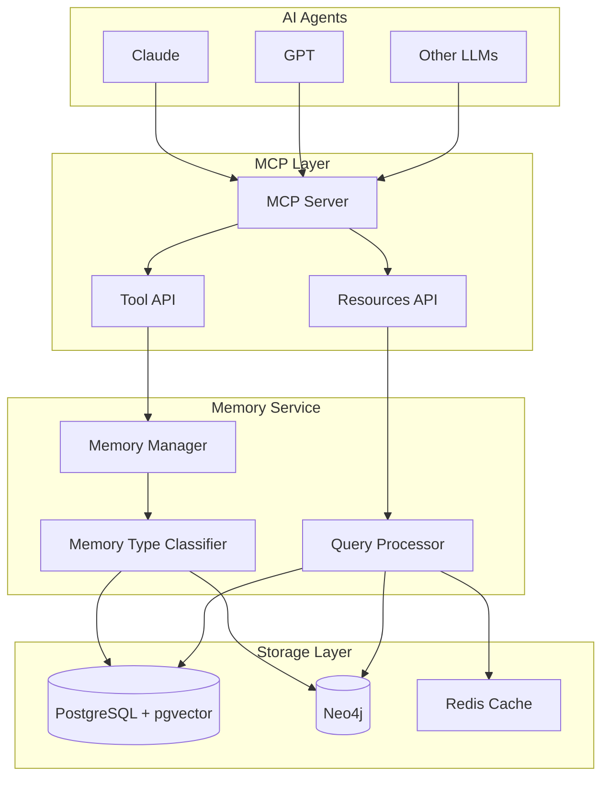
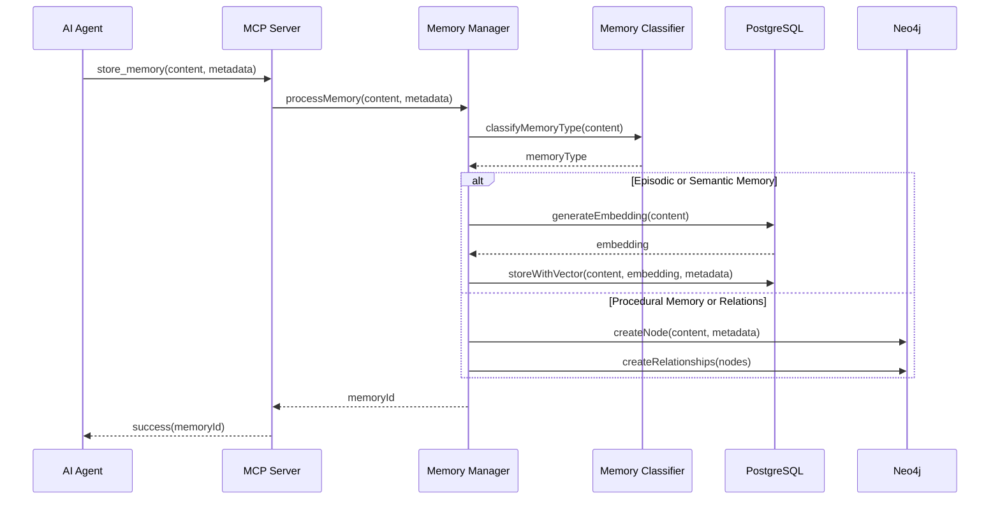
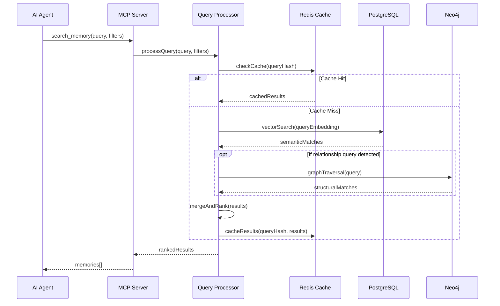

# 技術設計書

## 概要

**目的:** 本機能は、AIエージェントに対して永続的な記憶能力を提供し、セッションを越えた情報の保持と文脈に応じた知的検索を実現する。

**利用者:** AIアプリケーション開発者、エンドユーザーのAIエージェントは、過去の対話履歴、プロジェクト固有の知識、手続き的なノウハウを継続的に活用するためにこのシステムを利用する。

**影響:** 現在のステートレスなAIエージェントのアーキテクチャを、永続的な記憶層を持つステートフルなシステムへと変革し、より文脈に即した知的な対話を可能にする。

### 目標
- セッション間での情報の永続的な保存と検索の実現
- 人間の記憶メカニズムに着想を得た多層的な記憶管理の実装
- MCP標準に準拠した汎用的なツールインターフェースの提供
- 高速かつスケーラブルな記憶検索システムの構築

### 非目標
- LLMモデル自体の改良やファインチューニング
- リアルタイムストリーミングデータの処理
- 記憶内容の自動生成や創造的な拡張

## アーキテクチャ

### 高レベルアーキテクチャ



**アーキテクチャ統合:**
- 既存パターンの維持: MCP標準プロトコル、JSON-RPC通信
- 新規コンポーネントの根拠: 記憶タイプの分類と最適化されたストレージ選択のためMemory Type Classifierを追加
- 技術スタックの整合性: TypeScript実装により既存のNode.jsエコシステムと完全統合
- 設計原則の遵守: モジュール化、関心の分離、拡張性の確保

### 技術スタックと設計決定

**技術スタック:**

- **言語・ランタイム:** TypeScript 5.x / Node.js 20.x LTS
  - 選択理由: MCP公式SDKの完全サポート、型安全性の確保
  - 代替案: Python（考慮したが、TypeScriptエコシステムとの統合性を優先）

- **MCPフレームワーク:** @modelcontextprotocol/sdk v1.20.x
  - 選択理由: 公式SDK、安定性と互換性の保証
  - 代替案: 独自実装（標準準拠の保証が困難）

- **ベクトルデータベース:** PostgreSQL 16 + pgvector 0.7.x
  - 選択理由: ACID特性、既存RDBMSスキルの活用、統合管理
  - 代替案: Pinecone、Weaviate（専用DBは100万ベクトル以下では過剰）

- **グラフデータベース:** Neo4j 5.x Community Edition
  - 選択理由: 成熟したエコシステム、Cypherクエリ言語、TypeScript SDK
  - 代替案: ArangoDB（マルチモデルだが、グラフ特化機能で劣る）

**主要設計決定:**

**決定1: ハイブリッドストレージアーキテクチャの採用**
- **背景:** 異なる記憶タイプには異なるデータ構造が最適
- **代替案:** 単一データベース（PostgreSQLのみ）、NoSQL（MongoDB）、専用ベクトルDB
- **選択アプローチ:** PostgreSQL + pgvectorとNeo4jの組み合わせ
- **根拠:** 意味的検索と構造的関係の両方を最適化、各DBの強みを活用
- **トレードオフ:** 運用複雑性の増加と引き換えに、クエリ性能と柔軟性を獲得

**決定2: 記憶タイプの自動分類**
- **背景:** ユーザーは記憶タイプを意識せずに利用したい
- **代替案:** 明示的なタイプ指定、単一タイプのみサポート、タグベース分類
- **選択アプローチ:** コンテンツ分析による自動分類とユーザーによる上書き可能
- **根拠:** UXの向上と、必要に応じた細かい制御の両立
- **トレードオフ:** 分類精度の課題と引き換えに、使いやすさを優先

## システムフロー

### 記憶保存フロー



### 記憶検索フロー



## コンポーネントとインターフェース

### MCPサーバー層

#### Context Store MCP Server

**責任と境界**
- **主要責任:** MCP標準に準拠したツールとリソースのエンドポイント提供
- **ドメイン境界:** MCPプロトコル実装層
- **データ所有権:** セッション管理データ、接続状態
- **トランザクション境界:** 個別のツール呼び出し単位

**依存関係**
- **インバウンド:** AIエージェント（Claude、GPT等）
- **アウトバウンド:** Memory Manager、Query Processor
- **外部:** @modelcontextprotocol/sdk

**サービスインターフェース**
```typescript
interface ContextStoreMCPServer {
  // ツール定義
  tools: {
    store_memory: Tool<StoreMemoryParams, MemoryId>;
    search_memory: Tool<SearchParams, Memory[]>;
    delete_memory: Tool<DeleteParams, boolean>;
    update_memory: Tool<UpdateParams, boolean>;
  };

  // リソース定義
  resources: {
    memory_stats: Resource<void, MemoryStatistics>;
    memory_types: Resource<void, MemoryTypeInfo[]>;
  };

  // セッション管理
  handleConnection(transport: Transport): Promise<void>;
  handleDisconnection(sessionId: string): Promise<void>;
}

interface StoreMemoryParams {
  content: string;
  metadata?: {
    source?: string;
    timestamp?: Date;
    tags?: string[];
    memoryType?: 'episodic' | 'semantic' | 'procedural';
  };
}

interface SearchParams {
  query: string;
  filters?: {
    timeRange?: { start: Date; end: Date };
    memoryTypes?: Array<'episodic' | 'semantic' | 'procedural'>;
    tags?: string[];
    limit?: number;
  };
}
```

### メモリ管理層

#### Memory Manager

**責任と境界**
- **主要責任:** 記憶の保存、更新、削除のオーケストレーション
- **ドメイン境界:** 記憶管理ドメイン
- **データ所有権:** 記憶メタデータ、インデックス情報
- **トランザクション境界:** 記憶操作の完全性保証

**依存関係**
- **インバウンド:** MCP Server
- **アウトバウンド:** Memory Type Classifier、Storage Adapters
- **外部:** OpenAI Embeddings API、UUID library

**サービスインターフェース**
```typescript
interface MemoryManagerService {
  storeMemory(params: StoreMemoryParams): Promise<Result<MemoryId, MemoryError>>;
  updateMemory(id: MemoryId, updates: Partial<Memory>): Promise<Result<boolean, MemoryError>>;
  deleteMemory(id: MemoryId): Promise<Result<boolean, MemoryError>>;
  mergeMemories(ids: MemoryId[]): Promise<Result<MemoryId, MemoryError>>;

  // メモリ管理
  performGarbageCollection(): Promise<void>;
  optimizeStorage(): Promise<void>;
}

type MemoryError =
  | { type: 'STORAGE_ERROR'; message: string }
  | { type: 'INVALID_CONTENT'; message: string }
  | { type: 'MEMORY_NOT_FOUND'; message: string }
  | { type: 'QUOTA_EXCEEDED'; message: string };
```

#### Memory Type Classifier

**責任と境界**
- **主要責任:** コンテンツ分析による記憶タイプの自動分類
- **ドメイン境界:** 分類ロジックドメイン
- **データ所有権:** 分類ルール、学習モデル
- **トランザクション境界:** 単一分類操作

**サービスインターフェース**
```typescript
interface MemoryClassifierService {
  classifyContent(content: string): Promise<MemoryClassification>;
  getConfidenceScore(content: string, type: MemoryType): Promise<number>;
  trainClassifier(samples: TrainingSample[]): Promise<void>;
}

interface MemoryClassification {
  primaryType: MemoryType;
  confidence: number;
  suggestedTypes: Array<{
    type: MemoryType;
    confidence: number;
  }>;
}

type MemoryType = 'episodic' | 'semantic' | 'procedural';
```

### クエリ処理層

#### Query Processor

**責任と境界**
- **主要責任:** 複雑なクエリの解析と最適化された検索実行
- **ドメイン境界:** 検索・取得ドメイン
- **データ所有権:** クエリキャッシュ、検索インデックス
- **トランザクション境界:** 読み取り専用操作

**依存関係**
- **インバウンド:** MCP Server
- **アウトバウンド:** Vector Store Adapter、Graph Store Adapter、Cache Manager
- **外部:** Redis client、LangChain.js

**サービスインターフェース**
```typescript
interface QueryProcessorService {
  search(params: SearchParams): Promise<Result<Memory[], QueryError>>;

  // 高度な検索
  semanticSearch(query: string, limit: number): Promise<Memory[]>;
  graphTraversal(startNode: NodeId, pattern: string): Promise<Memory[]>;
  hybridSearch(params: HybridSearchParams): Promise<Memory[]>;

  // クエリ最適化
  analyzeQuery(query: string): QueryPlan;
  optimizeQueryPlan(plan: QueryPlan): OptimizedPlan;
}

interface HybridSearchParams {
  semanticQuery?: string;
  graphPattern?: string;
  filters: SearchFilters;
  weights: {
    semantic: number;
    structural: number;
  };
}
```

### ストレージアダプター層

#### Vector Store Adapter (PostgreSQL + pgvector)

**責任と境界**
- **主要責任:** ベクトル埋め込みの生成と類似性検索
- **ドメイン境界:** ベクトルストレージドメイン
- **データ所有権:** 埋め込みベクトル、非構造化テキストデータ

**外部依存関係の調査**
- pgvector: PostgreSQL拡張、v0.7.x使用
- OpenAI Embeddings: text-embedding-3-small (1536次元)
- LangChain.js: PGVectorStore実装

**サービスインターフェース**
```typescript
interface VectorStoreAdapter {
  // 基本操作
  storeWithEmbedding(content: string, metadata: Metadata): Promise<VectorId>;
  searchSimilar(query: string, limit: number): Promise<VectorSearchResult[]>;
  deleteVector(id: VectorId): Promise<boolean>;

  // バッチ操作
  bulkStore(items: VectorItem[]): Promise<VectorId[]>;
  reindexVectors(): Promise<void>;
}

interface VectorSearchResult {
  id: VectorId;
  content: string;
  similarity: number;
  metadata: Metadata;
}
```

#### Graph Store Adapter (Neo4j)

**責任と境界**
- **主要責任:** エンティティ間の関係性管理とグラフトラバーサル
- **ドメイン境界:** グラフストレージドメイン
- **データ所有権:** ノード、エッジ、グラフ構造

**外部依存関係の調査**
- Neo4j JavaScript Driver: v5.x
- Cypher Query Language: パターンマッチング
- Community Detection: Louvainアルゴリズム

**サービスインターフェース**
```typescript
interface GraphStoreAdapter {
  // ノード操作
  createNode(label: string, properties: NodeProperties): Promise<NodeId>;
  updateNode(id: NodeId, properties: Partial<NodeProperties>): Promise<boolean>;
  deleteNode(id: NodeId): Promise<boolean>;

  // 関係操作
  createRelationship(from: NodeId, to: NodeId, type: string): Promise<EdgeId>;
  traverseGraph(startNode: NodeId, pattern: CypherPattern): Promise<GraphResult[]>;

  // 分析
  findCommunities(): Promise<Community[]>;
  calculateCentrality(nodeId: NodeId): Promise<number>;
}

interface GraphResult {
  nodes: Node[];
  relationships: Relationship[];
  path?: Path;
}
```

## データモデル

### ドメインモデル

**コア概念:**

- **Memory Aggregate:** トランザクション境界を定義する記憶の集約ルート
  - ID、コンテンツ、メタデータを保持
  - 記憶タイプに応じた振る舞いをカプセル化

- **MemoryContent Entity:** 実際の記憶内容を表現
  - 一意のIDを持つ
  - 不変性を保証（更新時は新バージョン作成）

- **MemoryMetadata Value Object:** 記憶に関する付加情報
  - タイムスタンプ、ソース、タグなど
  - 不変オブジェクトとして実装

- **MemoryEvent Domain Event:** 記憶の状態変化を表現
  - MemoryStored、MemoryUpdated、MemoryDeleted
  - イベントソーシングパターンの基盤

**ビジネスルールと不変条件:**
- 記憶は必ず一つの主要タイプを持つ
- タイムスタンプは作成時に自動設定され変更不可
- 削除された記憶は論理削除とし、物理削除は別プロセス
- 同一内容の記憶は自動的にマージ候補として検出

### 論理データモデル

**構造定義:**

```mermaid
erDiagram
    Memory ||--o{ MemoryVector : has
    Memory ||--o{ MemoryRelation : from
    Memory ||--o{ MemoryRelation : to
    Memory {
        uuid id PK
        string content
        enum memory_type
        jsonb metadata
        timestamp created_at
        timestamp updated_at
        boolean is_deleted
    }

    MemoryVector {
        uuid id PK
        uuid memory_id FK
        vector embedding
        float similarity_threshold
    }

    MemoryRelation {
        uuid id PK
        uuid from_memory_id FK
        uuid to_memory_id FK
        string relation_type
        jsonb properties
        float weight
    }
```

**整合性とインテグリティ:**
- Memoryテーブルがマスターデータ
- 外部キー制約によるカスケード削除
- MemoryVectorは1対1または1対0の関係
- MemoryRelationは多対多の自己参照

### 物理データモデル

**PostgreSQL + pgvector:**

```sql
-- メモリテーブル
CREATE TABLE memories (
    id UUID PRIMARY KEY DEFAULT gen_random_uuid(),
    content TEXT NOT NULL,
    memory_type VARCHAR(20) NOT NULL,
    metadata JSONB DEFAULT '{}',
    created_at TIMESTAMP WITH TIME ZONE DEFAULT NOW(),
    updated_at TIMESTAMP WITH TIME ZONE DEFAULT NOW(),
    is_deleted BOOLEAN DEFAULT FALSE
);

-- ベクトルテーブル
CREATE TABLE memory_vectors (
    id UUID PRIMARY KEY DEFAULT gen_random_uuid(),
    memory_id UUID REFERENCES memories(id) ON DELETE CASCADE,
    embedding vector(1536) NOT NULL,
    UNIQUE(memory_id)
);

-- インデックス
CREATE INDEX idx_memories_type ON memories(memory_type);
CREATE INDEX idx_memories_created_at ON memories(created_at);
CREATE INDEX idx_memory_vectors_embedding ON memory_vectors
    USING hnsw (embedding vector_cosine_ops);
```

**Neo4j グラフスキーマ:**

```cypher
// ノード定義
CREATE CONSTRAINT memory_id_unique ON (m:Memory)
    ASSERT m.id IS UNIQUE;

// インデックス
CREATE INDEX memory_type_index FOR (m:Memory) ON (m.type);
CREATE INDEX memory_timestamp_index FOR (m:Memory) ON (m.timestamp);

// 関係タイプ
// (:Memory)-[:REFERENCES]->(:Memory)
// (:Memory)-[:DERIVED_FROM]->(:Memory)
// (:Memory)-[:CONTRADICTS]->(:Memory)
// (:Memory)-[:SUPPORTS]->(:Memory)
```

## エラーハンドリング

### エラー戦略

各エラータイプに対する具体的なハンドリングパターンと回復メカニズムを実装する。

### エラーカテゴリと対応

**ユーザーエラー (4xx):**
- 無効な入力 → フィールドレベルのバリデーションメッセージ
- 認証失敗 → MCPハンドシェイクの再試行ガイダンス
- リソース不在 → 代替検索クエリの提案

**システムエラー (5xx):**
- DB接続失敗 → コネクションプールの自動再接続、サーキットブレーカー
- タイムアウト → 段階的な再試行（指数バックオフ）
- リソース枯渇 → 自動ガベージコレクション、レート制限

**ビジネスロジックエラー (422):**
- メモリタイプ不整合 → 自動分類の再実行
- 容量超過 → 古い記憶の自動アーカイブ提案

### 監視

- Prometheusメトリクス: エラー率、レイテンシ、スループット
- 構造化ログ: Winston with JSON format
- アラート: エラー率閾値超過時のSlack通知

## テスト戦略

### ユニットテスト
- Memory Type Classifier: 分類精度テスト
- Query Parser: クエリ解析ロジック
- Vector Similarity: コサイン類似度計算
- Graph Traversal: Cypherクエリ生成
- MCP Protocol Handler: JSON-RPCメッセージ処理

### 統合テスト
- MCP Server ⇔ Memory Manager: ツール呼び出しフロー
- Memory Manager ⇔ Storage: トランザクション処理
- Query Processor ⇔ Databases: ハイブリッド検索
- Cache ⇔ Query Processor: キャッシュヒット率
- Error Recovery: フェイルオーバーシナリオ

### E2Eテスト
- 記憶の保存から検索までの完全フロー
- セッション間での記憶の永続性確認
- 複数エージェントからの同時アクセス
- メモリ容量制限時の動作確認

### パフォーマンステスト
- 100万記憶での検索レスポンス（目標: 2秒以内）
- 同時100接続でのスループット
- ベクトルインデックス再構築時間
- グラフトラバーサルの深さによる性能劣化

## セキュリティ考慮事項

### 認証と認可
- MCP標準の認証メカニズムを実装
- セッションベースのアクセス制御
- APIキーによるクライアント認証

### データ保護
- 保存時の暗号化: PostgreSQLのTDE有効化
- 転送時の暗号化: TLS 1.3必須
- 機密データのマスキング処理

### 監査とコンプライアンス
- 全アクセスログの記録と保持
- GDPR準拠の削除機能（完全削除）
- データ所在地の管理とコントロール

## パフォーマンスとスケーラビリティ

### 目標メトリクス
- 検索レイテンシ: P95 < 2秒
- スループット: 1000 req/sec
- 可用性: 99.9% SLA

### スケーリング戦略
- 水平スケーリング: MCPサーバーのステートレス設計
- Read Replica: PostgreSQL読み取り専用レプリカ
- シャーディング: memory_type別のパーティショニング

### 最適化手法
- Redis キャッシュ: ホットデータの高速アクセス
- 非同期処理: 埋め込み生成のバックグラウンド実行
- インデックス最適化: HNSW、B-treeの適切な設定