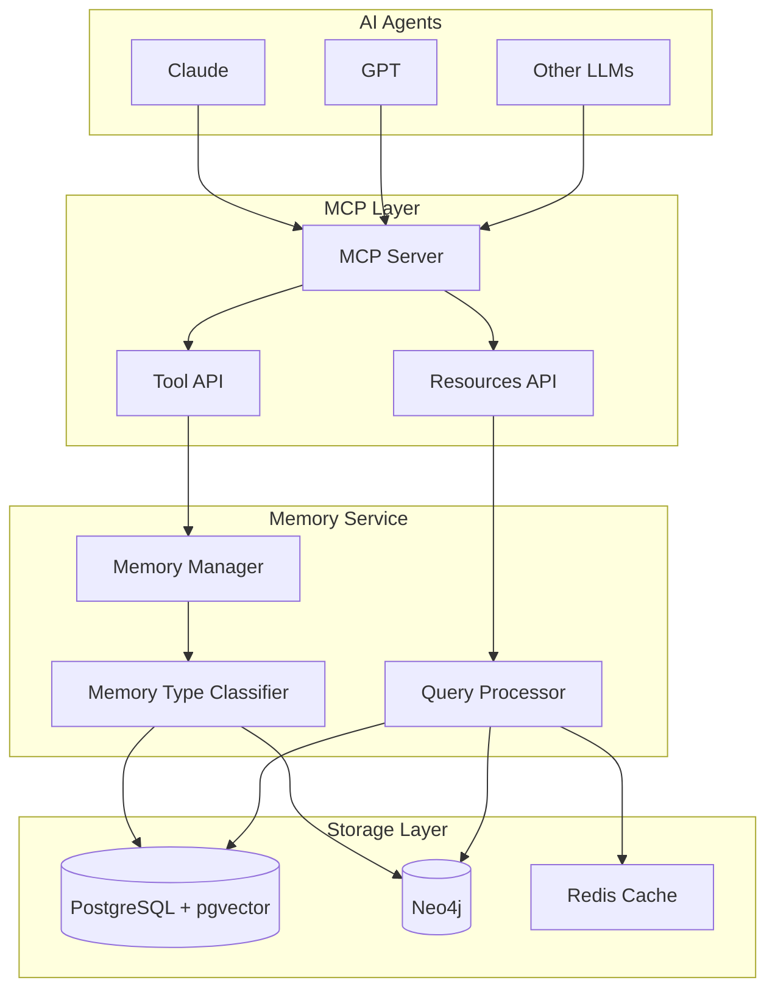
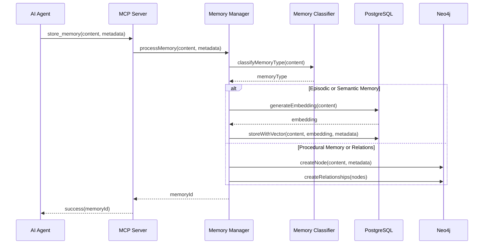
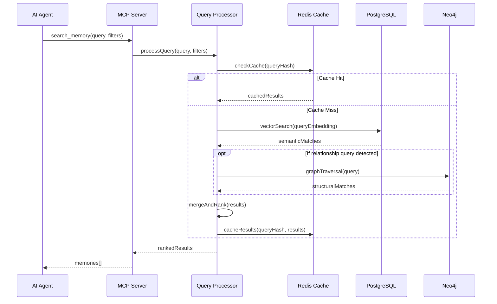
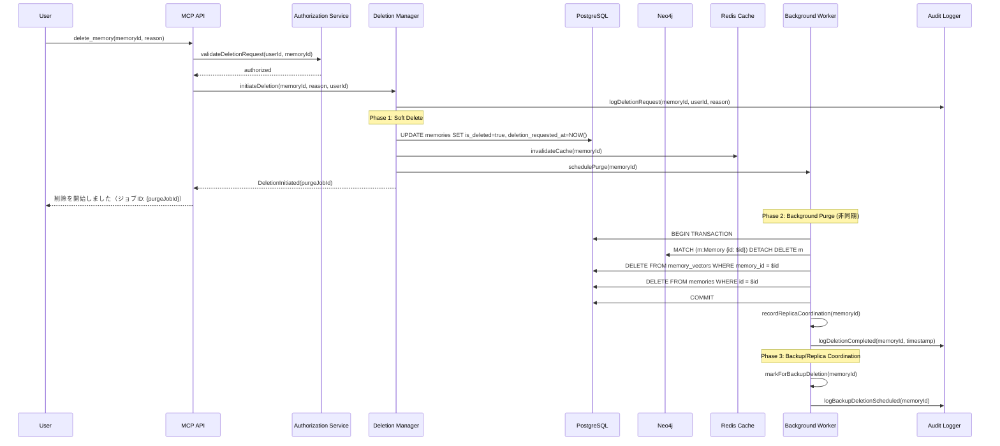
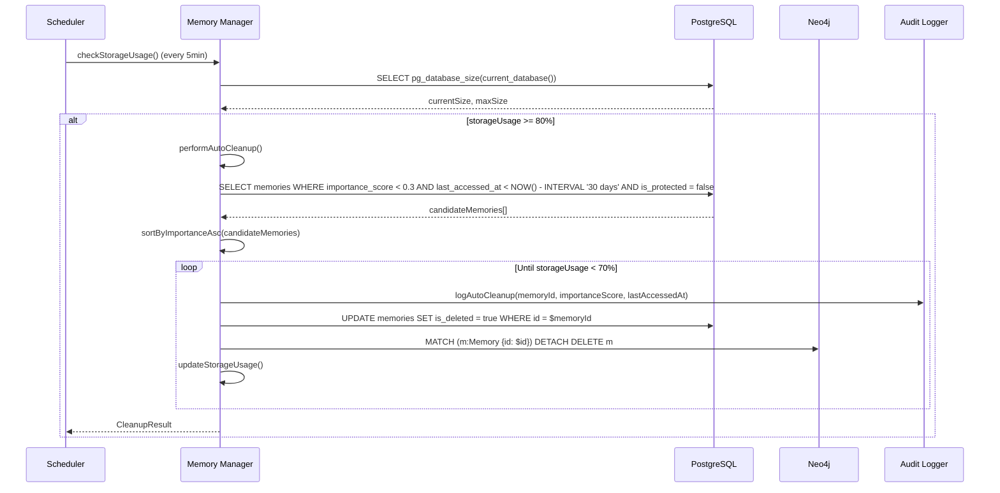

# 技術設計書

## 概要

**目的:** 本機能は、AIエージェントに対して永続的な記憶能力を提供し、セッションを越えた情報の保持と文脈に応じた知的検索を実現する。

**利用者:** AIアプリケーション開発者、エンドユーザーのAIエージェントは、過去の対話履歴、プロジェクト固有の知識、手続き的なノウハウを継続的に活用するためにこのシステムを利用する。

**影響:** 現在のステートレスなAIエージェントのアーキテクチャを、永続的な記憶層を持つステートフルなシステムへと変革し、より文脈に即した知的な対話を可能にする。

### 目標
- セッション間での情報の永続的な保存と検索の実現
- 人間の記憶メカニズムに着想を得た多層的な記憶管理の実装
- MCP標準に準拠した汎用的なツールインターフェースの提供
- 高速かつスケーラブルな記憶検索システムの構築

### 非目標
- LLMモデル自体の改良やファインチューニング
- リアルタイムストリーミングデータの処理
- 記憶内容の自動生成や創造的な拡張

## アーキテクチャ

### 高レベルアーキテクチャ



**アーキテクチャ統合:**
- 既存パターンの維持: MCP標準プロトコル、JSON-RPC通信
- 新規コンポーネントの根拠: 記憶タイプの分類と最適化されたストレージ選択のためMemory Type Classifierを追加
- 技術スタックの整合性: TypeScript実装により既存のNode.jsエコシステムと完全統合
- 設計原則の遵守: モジュール化、関心の分離、拡張性の確保

### 技術スタックと設計決定

**技術スタック:**

- **言語・ランタイム:** TypeScript 5.x / Node.js 20.x LTS
  - 選択理由: MCP公式SDKの完全サポート、型安全性の確保
  - 代替案: Python（考慮したが、TypeScriptエコシステムとの統合性を優先）

- **MCPフレームワーク:** @modelcontextprotocol/sdk v1.20.x
  - 選択理由: 公式SDK、安定性と互換性の保証
  - 代替案: 独自実装（標準準拠の保証が困難）

- **ベクトルデータベース:** PostgreSQL 16 + pgvector 0.7.x
  - 選択理由: ACID特性、既存RDBMSスキルの活用、統合管理
  - 代替案: Pinecone、Weaviate（専用DBは100万ベクトル以下では過剰）

- **グラフデータベース:** Neo4j 5.x Community Edition
  - 選択理由: 成熟したエコシステム、Cypherクエリ言語、TypeScript SDK
  - 代替案: ArangoDB（マルチモデルだが、グラフ特化機能で劣る）

**主要設計決定:**

**決定1: ハイブリッドストレージアーキテクチャの採用**
- **背景:** 異なる記憶タイプには異なるデータ構造が最適
- **代替案:** 単一データベース（PostgreSQLのみ）、NoSQL（MongoDB）、専用ベクトルDB
- **選択アプローチ:** PostgreSQL + pgvectorとNeo4jの組み合わせ
- **根拠:** 意味的検索と構造的関係の両方を最適化、各DBの強みを活用
- **トレードオフ:** 運用複雑性の増加と引き換えに、クエリ性能と柔軟性を獲得

**決定2: 記憶タイプの自動分類**
- **背景:** ユーザーは記憶タイプを意識せずに利用したい
- **代替案:** 明示的なタイプ指定、単一タイプのみサポート、タグベース分類
- **選択アプローチ:** コンテンツ分析による自動分類とユーザーによる上書き可能
- **根拠:** UXの向上と、必要に応じた細かい制御の両立
- **トレードオフ:** 分類精度の課題と引き換えに、使いやすさを優先（全体精度70%以上、タイプ別F1スコア0.65以上を最低限確保し、ユーザー修正率15%以下を目指す - requirements.md 要件3.4参照）

## システムフロー

### 記憶保存フロー



### 記憶検索フロー



## コンポーネントとインターフェース

### MCPサーバー層

#### Context Store MCP Server

**責任と境界**
- **主要責任:** MCP標準に準拠したツールとリソースのエンドポイント提供
- **ドメイン境界:** MCPプロトコル実装層
- **データ所有権:** セッション管理データ、接続状態
- **トランザクション境界:** 個別のツール呼び出し単位

**依存関係**
- **インバウンド:** AIエージェント（Claude、GPT等）
- **アウトバウンド:** Memory Manager、Query Processor
- **外部:** @modelcontextprotocol/sdk

**サービスインターフェース**
```typescript
interface ContextStoreMCPServer {
  // ツール定義
  tools: {
    store_memory: Tool<StoreMemoryParams, MemoryId>;
    search_memory: Tool<SearchParams, Memory[]>;
    delete_memory: Tool<DeleteParams, boolean>;
    update_memory: Tool<UpdateParams, boolean>;
  };

  // リソース定義
  resources: {
    memory_stats: Resource<void, MemoryStatistics>;
    memory_types: Resource<void, MemoryTypeInfo[]>;
  };

  // セッション管理
  handleConnection(transport: Transport): Promise<void>;
  handleDisconnection(sessionId: string): Promise<void>;
}

interface StoreMemoryParams {
  content: string;
  metadata?: {
    source?: string;
    timestamp?: Date;
    tags?: string[];
    memoryType?: 'episodic' | 'semantic' | 'procedural';
  };
}

interface SearchParams {
  query: string;
  filters?: {
    timeRange?: { start: Date; end: Date };
    memoryTypes?: Array<'episodic' | 'semantic' | 'procedural'>;
    tags?: string[];
    limit?: number;
  };
}
```

### メモリ管理層

#### Memory Manager

**責任と境界**
- **主要責任:** 記憶の保存、更新、削除のオーケストレーション
- **ドメイン境界:** 記憶管理ドメイン
- **データ所有権:** 記憶メタデータ、インデックス情報
- **トランザクション境界:** 記憶操作の完全性保証

**依存関係**
- **インバウンド:** MCP Server
- **アウトバウンド:** Memory Type Classifier、Storage Adapters
- **外部:** OpenAI Embeddings API、UUID library

**サービスインターフェース**
```typescript
interface MemoryManagerService {
  storeMemory(params: StoreMemoryParams): Promise<Result<MemoryId, MemoryError>>;
  updateMemory(id: MemoryId, updates: Partial<Memory>): Promise<Result<boolean, MemoryError>>;
  deleteMemory(id: MemoryId): Promise<Result<boolean, MemoryError>>;
  mergeMemories(ids: MemoryId[]): Promise<Result<MemoryId, MemoryError>>;

  // メモリ管理
  performGarbageCollection(): Promise<void>;
  optimizeStorage(): Promise<void>;

  // 自動整理（要件1.4対応）
  performAutoCleanup(): Promise<CleanupResult>;
  updateImportanceScores(): Promise<void>;
  calculateImportanceScore(memoryId: MemoryId): Promise<number>;
}

interface CleanupResult {
  deletedCount: number;
  freedSpaceBytes: number;
  storageUsageBefore: number;  // 0.0 - 1.0
  storageUsageAfter: number;   // 0.0 - 1.0
  deletedMemories: Array<{
    id: MemoryId;
    importanceScore: number;
    lastAccessedAt: Date;
  }>;
}

type MemoryError =
  | { type: 'STORAGE_ERROR'; message: string }
  | { type: 'INVALID_CONTENT'; message: string }
  | { type: 'MEMORY_NOT_FOUND'; message: string }
  | { type: 'QUOTA_EXCEEDED'; message: string };
```

#### Memory Type Classifier

**責任と境界**
- **主要責任:** コンテンツ分析による記憶タイプの自動分類
- **ドメイン境界:** 分類ロジックドメイン
- **データ所有権:** 分類ルール、学習モデル
- **トランザクション境界:** 単一分類操作

**分類アルゴリズム詳細**

**アプローチ:** ルールベース + 埋め込みベース のハイブリッド方式

1. **特徴量抽出:**
   - **時間表現の検出:** 「昨日」「先週」「2024年1月」等のタイムスタンプ指標
   - **キーワード分析:**
     - エピソード: 「会話した」「議論した」「話した」「決めた」
     - 意味: 「仕様」「定義」「ルール」「概念」「APIは」
     - 手続き: 「方法」「手順」「解決策」「修正した」「実装する」
   - **構文パターン:**
     - エピソード: 過去形動詞の頻度、対話的表現
     - 意味: 「である」「とは」等の定義文
     - 手続き: 命令形、ステップ表記（1., 2., ...）
   - **埋め込み類似度:** 既存の分類済み記憶との意味的類似性

2. **スコアリング方式:**
   - ルールベーススコア（0-1）: 各タイプの特徴量マッチ度
   - 埋め込みスコア（0-1）: 類似記憶タイプとのコサイン類似度
   - 最終スコア: `0.6 * ルールベース + 0.4 * 埋め込み`

3. **閾値設定:**
   - **高信頼度:** スコア ≥ 0.8 → 自動分類確定
   - **中信頼度:** 0.6 ≤ スコア < 0.8 → 推奨タイプとして提示
   - **低信頼度:** スコア < 0.6 → デフォルト（semantic）+ 警告

**精度目標と測定:**
- **初期精度目標:** 70% （100サンプル手動分類との一致率）
- **運用時目標:** 85%以上 （ユーザー修正率15%以下）
- **測定方法:**
  - ユーザーによる明示的なタイプ上書き頻度を記録
  - 週次で分類精度レポートを生成
  - 誤分類パターンの分析と学習

**許容範囲:**
- エピソード/意味記憶の誤分類: 20%まで許容（ストレージ方式が類似）
- 手続き記憶の誤検出: 10%以下（グラフ構造への影響大）

**サービスインターフェース**
```typescript
interface MemoryClassifierService {
  classifyContent(content: string): Promise<MemoryClassification>;
  getConfidenceScore(content: string, type: MemoryType): Promise<number>;
  trainClassifier(samples: TrainingSample[]): Promise<void>;

  // 精度測定
  evaluateAccuracy(testSamples: LabeledSample[]): Promise<AccuracyMetrics>;
  getClassificationStats(): Promise<ClassificationStats>;
}

interface MemoryClassification {
  primaryType: MemoryType;
  confidence: number; // 0.0 - 1.0
  suggestedTypes: Array<{
    type: MemoryType;
    confidence: number;
  }>;
  features: {
    ruleBasedScore: number;
    embeddingScore: number;
    detectedKeywords: string[];
  };
}

interface AccuracyMetrics {
  overall: number; // 全体精度
  perType: Record<MemoryType, number>; // タイプ別精度
  confusionMatrix: number[][]; // 混同行列
}

interface ClassificationStats {
  totalClassified: number;
  userOverrideRate: number; // ユーザー修正率
  averageConfidence: number;
  lowConfidenceCount: number;
}

type MemoryType = 'episodic' | 'semantic' | 'procedural';
```

### クエリ処理層

#### Query Processor

**責任と境界**
- **主要責任:** 複雑なクエリの解析と最適化された検索実行
- **ドメイン境界:** 検索・取得ドメイン
- **データ所有権:** クエリキャッシュ、検索インデックス
- **トランザクション境界:** 読み取り専用操作

**依存関係**
- **インバウンド:** MCP Server
- **アウトバウンド:** Vector Store Adapter、Graph Store Adapter、Cache Manager
- **外部:** Redis client、LangChain.js

**ハイブリッド検索のスコアリング詳細**

ハイブリッド検索は、ベクトル類似性検索（意味的）とグラフトラバーサル（構造的）の結果を統合し、重み付けスコアで順位付けする。

**1. スコア正規化:**

- **ベクトル類似性スコア（semantic_score）:**
  - pgvectorのコサイン類似度は既に [0, 1] 範囲
  - 正規化不要、そのまま使用: `semantic_score = cosine_similarity`

- **グラフスコア（structural_score）:**
  - Neo4jのパス長（hop数）を指数減衰で [0, 1] に正規化
  - 公式: `structural_score = exp(-α * path_length)`
  - デフォルトパラメータ: `α = 1.0`
  - 例:
    - path_length = 0 (自己ノード): score = 1.0
    - path_length = 1 (直接リンク): score = 0.368
    - path_length = 2: score = 0.135
    - path_length = 3: score = 0.050

**2. 重み付け統合:**

- **最終スコア計算式:**
  ```
  final_score = w_semantic * semantic_score + w_structural * structural_score
  ```

- **重み正規化:**
  - 入力された重みが `w_semantic + w_structural ≠ 1.0` の場合、自動正規化:
  ```
  total = w_semantic + w_structural
  w_semantic_norm = w_semantic / total
  w_structural_norm = w_structural / total
  ```

- **推奨デフォルト重み:**
  - `w_semantic = 0.7, w_structural = 0.3`
  - 根拠: 意味的類似性が主要な検索軸、構造的関係は補助的

**3. 重み調整ガイドライン:**

- **意味重視（w_semantic > 0.7）:**
  - ユースケース: 「似た内容の記憶を探す」
  - 例: コーディング規約の類似パターン検索

- **構造重視（w_structural > 0.5）:**
  - ユースケース: 「この記憶に関連する記憶チェーンを辿る」
  - 例: 問題解決の手順依存関係の追跡

- **バランス型（w_semantic ≈ w_structural ≈ 0.5）:**
  - ユースケース: 内容と関係性の両方が重要
  - 例: プロジェクト全体の文脈理解

**4. タイブレークルール:**

同一スコア（許容誤差 `ε = 1e-6` 以内）の場合、以下の順で優先:

1. **意味的スコア優先:** `semantic_score` が高い方を優先
2. **パス長優先:** `path_length` が短い方を優先（より直接的な関係）
3. **ID順:** 上記が同一の場合、UUID の辞書順で決定的にソート

**サービスインターフェース**
```typescript
interface QueryProcessorService {
  search(params: SearchParams): Promise<Result<Memory[], QueryError>>;

  // 高度な検索
  semanticSearch(query: string, limit: number): Promise<Memory[]>;
  graphTraversal(startNode: NodeId, pattern: string): Promise<Memory[]>;
  hybridSearch(params: HybridSearchParams): Promise<Memory[]>;

  // クエリ最適化
  analyzeQuery(query: string): QueryPlan;
  optimizeQueryPlan(plan: QueryPlan): OptimizedPlan;

  // 検索品質評価（要件2.1対応）
  evaluateSearchQuality(testSet: SearchEvaluationDataset): Promise<SearchQualityMetrics>;
  logSearchResult(query: string, results: Memory[], userFeedback?: RelevanceFeedback): Promise<void>;
}

interface SearchEvaluationDataset {
  queries: Array<{
    query: string;
    relevantMemoryIds: MemoryId[];
    annotators: string[];  // 最低2名以上の専門家
    interAnnotatorAgreement?: number;  // Fleiss' Kappa係数
  }>;
  metadata: {
    createdAt: Date;
    version: string;
    totalQueries: number;
    minimumQueries: 100;  // 要件: 最低100クエリ
  };
}

interface SearchQualityMetrics {
  precisionAt10: number;      // Precision@10 ≥ 0.8
  recallAt50: number;         // Recall@50 ≥ 0.7
  f1Score: number;            // F1スコア ≥ 0.75
  meanAveragePrecision: number;  // MAP
  evaluatedAt: Date;
  testSetSize: number;
  passedThresholds: {
    precisionAt10Passed: boolean;  // >= 0.8
    recallAt50Passed: boolean;     // >= 0.7
    f1ScorePassed: boolean;        // >= 0.75
  };
}

interface RelevanceFeedback {
  userId: string;
  relevanceJudgments: Array<{
    memoryId: MemoryId;
    isRelevant: boolean;
    relevanceLevel?: 0 | 1 | 2 | 3;  // 0: 無関係, 1: やや関連, 2: 関連, 3: 高関連
  }>;
  timestamp: Date;
}

interface HybridSearchParams {
  semanticQuery?: string;
  graphPattern?: string;
  filters: SearchFilters;
  weights: {
    semantic: number;      // デフォルト: 0.7
    structural: number;    // デフォルト: 0.3
  };
  scoringConfig?: {
    alpha?: number;        // グラフスコア減衰率（デフォルト: 1.0）
    epsilon?: number;      // タイブレーク許容誤差（デフォルト: 1e-6）
  };
}

interface HybridSearchResult {
  memory: Memory;
  scores: {
    semantic: number;       // 0.0 - 1.0
    structural: number;     // 0.0 - 1.0
    final: number;          // 0.0 - 1.0
  };
  metadata: {
    pathLength?: number;    // グラフ検索時のホップ数
    cosineSimilarity?: number;  // ベクトル検索時の生スコア
  };
}
```

### ストレージアダプター層

#### Vector Store Adapter (PostgreSQL + pgvector)

**責任と境界**
- **主要責任:** ベクトル埋め込みの生成と類似性検索
- **ドメイン境界:** ベクトルストレージドメイン
- **データ所有権:** 埋め込みベクトル、非構造化テキストデータ

**外部依存関係の調査**
- pgvector: PostgreSQL拡張、v0.7.x使用
- OpenAI Embeddings: text-embedding-3-small (1536次元)
- LangChain.js: PGVectorStore実装

**サービスインターフェース**
```typescript
interface VectorStoreAdapter {
  // 基本操作
  storeWithEmbedding(content: string, metadata: Metadata): Promise<VectorId>;
  searchSimilar(query: string, limit: number): Promise<VectorSearchResult[]>;
  deleteVector(id: VectorId): Promise<boolean>;

  // バッチ操作
  bulkStore(items: VectorItem[]): Promise<VectorId[]>;
  reindexVectors(): Promise<void>;
}

interface VectorSearchResult {
  id: VectorId;
  content: string;
  similarity: number;
  metadata: Metadata;
}
```

#### Graph Store Adapter (Neo4j)

**責任と境界**
- **主要責任:** エンティティ間の関係性管理とグラフトラバーサル
- **ドメイン境界:** グラフストレージドメイン
- **データ所有権:** ノード、エッジ、グラフ構造

**外部依存関係の調査**
- Neo4j JavaScript Driver: v5.x
- Cypher Query Language: パターンマッチング
- Community Detection: Louvainアルゴリズム

**サービスインターフェース**
```typescript
interface GraphStoreAdapter {
  // ノード操作
  createNode(label: string, properties: NodeProperties): Promise<NodeId>;
  updateNode(id: NodeId, properties: Partial<NodeProperties>): Promise<boolean>;
  deleteNode(id: NodeId): Promise<boolean>;

  // 関係操作
  createRelationship(from: NodeId, to: NodeId, type: string): Promise<EdgeId>;
  traverseGraph(startNode: NodeId, pattern: CypherPattern): Promise<GraphResult[]>;

  // 分析
  findCommunities(): Promise<Community[]>;
  calculateCentrality(nodeId: NodeId): Promise<number>;
}

interface GraphResult {
  nodes: Node[];
  relationships: Relationship[];
  path?: Path;
}
```

## データモデル

### ドメインモデル

**コア概念:**

- **Memory Aggregate:** トランザクション境界を定義する記憶の集約ルート
  - ID、コンテンツ、メタデータを保持
  - 記憶タイプに応じた振る舞いをカプセル化

- **MemoryContent Entity:** 実際の記憶内容を表現
  - 一意のIDを持つ
  - 不変性を保証（更新時は新バージョン作成）

- **MemoryMetadata Value Object:** 記憶に関する付加情報
  - タイムスタンプ、ソース、タグなど
  - 不変オブジェクトとして実装

- **MemoryEvent Domain Event:** 記憶の状態変化を表現
  - MemoryStored、MemoryUpdated、MemoryDeleted
  - イベントソーシングパターンの基盤

**ビジネスルールと不変条件:**
- 記憶は必ず一つの主要タイプを持つ
- タイムスタンプは作成時に自動設定され変更不可
- 削除された記憶は論理削除とし、物理削除は別プロセス
- 同一内容の記憶は自動的にマージ候補として検出

### 論理データモデル

**構造定義:**

```mermaid
erDiagram
    Memory ||--o{ MemoryVector : has
    Memory ||--o{ MemoryRelation : from
    Memory ||--o{ MemoryRelation : to
    Memory {
        uuid id PK
        string content
        enum memory_type
        jsonb metadata
        timestamp created_at
        timestamp updated_at
        boolean is_deleted
    }

    MemoryVector {
        uuid id PK
        uuid memory_id FK
        vector embedding
        float similarity_threshold
    }

    MemoryRelation {
        uuid id PK
        uuid from_memory_id FK
        uuid to_memory_id FK
        string relation_type
        jsonb properties
        float weight
    }
```

**整合性とインテグリティ:**
- Memoryテーブルがマスターデータ
- 外部キー制約によるカスケード削除
- MemoryVectorは1対1または1対0の関係
- MemoryRelationは多対多の自己参照

### 物理データモデル

**PostgreSQL + pgvector:**

```sql
-- メモリテーブル
CREATE TABLE memories (
    id UUID PRIMARY KEY DEFAULT gen_random_uuid(),
    content TEXT NOT NULL,
    memory_type VARCHAR(20) NOT NULL,
    metadata JSONB DEFAULT '{}',
    created_at TIMESTAMP WITH TIME ZONE DEFAULT NOW(),
    updated_at TIMESTAMP WITH TIME ZONE DEFAULT NOW(),
    last_accessed_at TIMESTAMP WITH TIME ZONE DEFAULT NOW(),
    access_count INT DEFAULT 0,
    importance_score FLOAT DEFAULT 0.0,
    is_deleted BOOLEAN DEFAULT FALSE,
    is_protected BOOLEAN DEFAULT FALSE,
    deletion_requested_at TIMESTAMP WITH TIME ZONE
);

-- ベクトルテーブル
CREATE TABLE memory_vectors (
    id UUID PRIMARY KEY DEFAULT gen_random_uuid(),
    memory_id UUID REFERENCES memories(id) ON DELETE CASCADE,
    embedding vector(1536) NOT NULL,
    UNIQUE(memory_id)
);

-- インデックス
CREATE INDEX idx_memories_type ON memories(memory_type);
CREATE INDEX idx_memories_created_at ON memories(created_at);
CREATE INDEX idx_memories_is_deleted ON memories(is_deleted);
CREATE INDEX idx_memories_last_accessed ON memories(last_accessed_at);
CREATE INDEX idx_memories_importance_score ON memories(importance_score);
CREATE INDEX idx_memories_protected ON memories(is_protected) WHERE is_protected = true;
CREATE INDEX idx_memory_vectors_embedding ON memory_vectors
    USING hnsw (embedding vector_cosine_ops);

-- GDPR準拠削除関連テーブル
CREATE TABLE deletion_audit_log (
    id UUID PRIMARY KEY DEFAULT gen_random_uuid(),
    memory_id UUID NOT NULL,
    event_type VARCHAR(50) NOT NULL,
    user_id UUID,
    reason TEXT,
    timestamp TIMESTAMP WITH TIME ZONE DEFAULT NOW(),
    metadata JSONB DEFAULT '{}',
    content_checksum VARCHAR(64) -- SHA256 hash
);

CREATE TABLE deletion_failures (
    id UUID PRIMARY KEY DEFAULT gen_random_uuid(),
    memory_id UUID NOT NULL,
    failure_mode VARCHAR(50) NOT NULL,
    error_message TEXT,
    retry_count INT DEFAULT 0,
    last_retry_at TIMESTAMP WITH TIME ZONE,
    created_at TIMESTAMP WITH TIME ZONE DEFAULT NOW()
);

CREATE TABLE backup_deletion_queue (
    id UUID PRIMARY KEY DEFAULT gen_random_uuid(),
    memory_id UUID NOT NULL,
    deletion_timestamp TIMESTAMP WITH TIME ZONE DEFAULT NOW(),
    retention_end_date TIMESTAMP WITH TIME ZONE NOT NULL,
    processed BOOLEAN DEFAULT FALSE
);

-- インデックス（削除関連）
CREATE INDEX idx_deletion_audit_memory_id ON deletion_audit_log(memory_id);
CREATE INDEX idx_deletion_audit_timestamp ON deletion_audit_log(timestamp);
CREATE INDEX idx_deletion_failures_memory_id ON deletion_failures(memory_id);
CREATE INDEX idx_backup_deletion_processed ON backup_deletion_queue(processed, retention_end_date);

-- 自動整理関連テーブル
CREATE TABLE search_result_log (
    id UUID PRIMARY KEY DEFAULT gen_random_uuid(),
    memory_id UUID NOT NULL REFERENCES memories(id) ON DELETE CASCADE,
    query TEXT NOT NULL,
    relevance_score FLOAT,
    searched_at TIMESTAMP WITH TIME ZONE DEFAULT NOW()
);

-- インデックス（自動整理関連）
CREATE INDEX idx_search_result_memory_id ON search_result_log(memory_id);
CREATE INDEX idx_search_result_searched_at ON search_result_log(searched_at);
CREATE INDEX idx_search_result_log_cleanup ON search_result_log(searched_at) WHERE searched_at < NOW() - INTERVAL '30 days';

-- 検索品質評価関連テーブル
CREATE TABLE user_feedback_log (
    id UUID PRIMARY KEY DEFAULT gen_random_uuid(),
    user_id UUID NOT NULL,
    query TEXT NOT NULL,
    judgments JSONB NOT NULL,  -- Array of {memoryId, isRelevant, relevanceLevel}
    feedback_at TIMESTAMP WITH TIME ZONE DEFAULT NOW()
);

-- インデックス（検索品質評価関連）
CREATE INDEX idx_user_feedback_query ON user_feedback_log(query);
CREATE INDEX idx_user_feedback_at ON user_feedback_log(feedback_at);
```

**Neo4j グラフスキーマ:**

```cypher
// ノード定義
CREATE CONSTRAINT memory_id_unique ON (m:Memory)
    ASSERT m.id IS UNIQUE;

// インデックス
CREATE INDEX memory_type_index FOR (m:Memory) ON (m.type);
CREATE INDEX memory_timestamp_index FOR (m:Memory) ON (m.timestamp);

// 関係タイプ（requirements.md 要件3.5に準拠）
// (:Memory)-[:REFERENCES {strength: 0.0-1.0, createdAt: timestamp, createdBy: string, reasoning: string}]->(:Memory)
// (:Memory)-[:DERIVED_FROM {strength: 0.0-1.0, createdAt: timestamp, createdBy: string, reasoning: string}]->(:Memory)
// (:Memory)-[:CONTRADICTS {strength: 0.0-1.0, createdAt: timestamp, createdBy: string, reasoning: string}]->(:Memory)
// (:Memory)-[:SUPPORTS {strength: 0.0-1.0, createdAt: timestamp, createdBy: string, reasoning: string}]->(:Memory)
// (:Memory)-[:PREREQUISITE {strength: 0.0-1.0, createdAt: timestamp, createdBy: string, reasoning: string}]->(:Memory)
// (:Memory)-[:NEXT_STEP {strength: 0.0-1.0, createdAt: timestamp, createdBy: string, reasoning: string}]->(:Memory)

// 双方向リンクの例（Cypherクエリ）:
// MATCH (a:Memory {id: $memoryId})-[r]-(b:Memory)  // どちらの方向でもリンクを辿れる
// RETURN a, r, b;
```

### ハイブリッドストレージの一貫性戦略

PostgreSQLとNeo4j間のデータ一貫性を保証するための明確な戦略を定義する。

**1. データ分割ポリシー（Single Source of Truth）**

- **PostgreSQL（マスターDB）:**
  - `memories` テーブルが**唯一の真実の源（Source of Truth）**
  - 全記憶の基本属性（ID、content、metadata、timestamps）を管理
  - `memory_vectors` テーブルが埋め込みベクトルを保持

- **Neo4j（セカンダリDB）:**
  - PostgreSQLの記憶IDを参照するノードを持つ（同一UUID）
  - 関係性情報のみを管理（エッジ、プロパティ）
  - ノードの`content`は保存せず、IDとメタデータのみ

- **データ重複の原則:**
  - 記憶の内容（content）はPostgreSQLのみに保存
  - Neo4jノードには`id`, `type`, `created_at`のみ複製
  - 検索結果の統合時、PostgreSQLから完全なデータを取得

**2. トランザクション戦略（Saga Pattern）**

分散トランザクションは複雑性が高いため、**Sagaパターン**を採用し、各ストレージへの操作を順序実行し、失敗時は補償トランザクションで巻き戻す。

**記憶保存フロー:**

```typescript
async function storeMemory(content: string, metadata: Metadata): Promise<MemoryId> {
  const memoryId = generateUUID();
  let pgSaved = false;
  let neoSaved = false;

  try {
    // Step 1: PostgreSQL に保存（マスターDB）
    await pgClient.query('BEGIN');
    await pgClient.query(
      'INSERT INTO memories (id, content, metadata, ...) VALUES ($1, $2, $3, ...)',
      [memoryId, content, metadata]
    );
    await pgClient.query(
      'INSERT INTO memory_vectors (memory_id, embedding) VALUES ($1, $2)',
      [memoryId, embedding]
    );
    await pgClient.query('COMMIT');
    pgSaved = true;

    // Step 2: Neo4j にノードを作成（セカンダリDB）
    if (requiresGraphStorage(memoryType)) {
      await neoSession.run(
        'CREATE (m:Memory {id: $id, type: $type, created_at: $createdAt})',
        { id: memoryId, type: memoryType, createdAt: timestamp }
      );
      neoSaved = true;
    }

    return memoryId;

  } catch (error) {
    // 補償トランザクション
    if (pgSaved && !neoSaved) {
      // PostgreSQL のみ成功 → Neo4j 失敗は許容（後で同期）
      await recordSyncFailure(memoryId, 'neo4j_creation_failed');
      logger.warn(`Neo4j sync failed for ${memoryId}, will retry later`);
    }

    if (!pgSaved) {
      // PostgreSQL 失敗 → 全体をロールバック
      throw new StorageError('Failed to store memory in master database');
    }

    throw error;
  }
}
```

**削除フロー:**

```typescript
async function deleteMemory(memoryId: MemoryId): Promise<boolean> {
  try {
    // Step 1: Neo4j から削除（依存関係を先に削除）
    await neoSession.run(
      'MATCH (m:Memory {id: $id}) DETACH DELETE m',
      { id: memoryId }
    );

    // Step 2: PostgreSQL から削除（マスターDB）
    await pgClient.query('BEGIN');
    await pgClient.query(
      'UPDATE memories SET is_deleted = true WHERE id = $1',
      [memoryId]
    );
    await pgClient.query('COMMIT');

    return true;

  } catch (error) {
    // Neo4j 削除失敗は許容（孤立ノードとして後で清掃）
    // PostgreSQL 削除失敗は致命的エラー
    if (error.source === 'postgresql') {
      throw new StorageError('Failed to delete memory from master database');
    }

    await recordSyncFailure(memoryId, 'neo4j_deletion_failed');
    logger.warn(`Neo4j deletion failed for ${memoryId}, orphan node will be cleaned later`);
    return true;  // PostgreSQL での削除が成功していれば、操作は成功とみなす
  }
}
```

**3. 整合性保証メカニズム**

- **PostgreSQL → Neo4j 同期キュー:**
  - 非同期ワーカーが定期的にPostgreSQLの変更を検出
  - 失敗した同期操作を再試行（指数バックオフ、最大24時間）
  - `sync_failures` テーブルで同期失敗を追跡

- **定期整合性チェック（Reconciliation）:**
  - 日次バッチジョブで両DB間の不一致を検出
  - PostgreSQLに存在するがNeo4jにないノード → 作成
  - Neo4jに存在するがPostgreSQLにないノード → 削除（孤立ノード）
  - 不一致カウントを監視メトリクスとして記録

- **一貫性監視:**
  ```sql
  -- PostgreSQL: 同期失敗の追跡
  CREATE TABLE sync_failures (
    id UUID PRIMARY KEY,
    memory_id UUID NOT NULL,
    operation VARCHAR(50) NOT NULL, -- 'create', 'update', 'delete'
    target_db VARCHAR(20) NOT NULL, -- 'neo4j'
    error_message TEXT,
    retry_count INT DEFAULT 0,
    created_at TIMESTAMP DEFAULT NOW(),
    last_retry_at TIMESTAMP
  );
  ```

**4. 許容可能な不整合と復旧戦略**

- **許容される一時的不整合:**
  - Neo4jノード作成遅延: 最大5分まで許容（非同期同期による）
  - Neo4j孤立ノード: 日次清掃で削除

- **許容されない不整合:**
  - PostgreSQLとNeo4jで異なるID
  - PostgreSQLに存在しないメモリのNeo4jノード（24時間以上）

- **復旧手順:**
  1. 自動再試行（指数バックオフ: 1min, 5min, 30min, 2h, 12h, 24h）
  2. 24時間後も失敗 → アラート発火、手動介入
  3. 整合性レポート生成（日次）

**5. トランザクション境界の明確化**

- **ACID保証範囲:** PostgreSQL内のみ
- **結果整合性（Eventual Consistency）:** PostgreSQL ⇔ Neo4j間
- **最大不整合時間:** 5分（通常）、24時間（障害時）

## エラーハンドリング

### エラー戦略

各エラータイプに対する具体的なハンドリングパターンと回復メカニズムを実装する。

### エラーカテゴリと対応

**ユーザーエラー (4xx):**
- 無効な入力 → フィールドレベルのバリデーションメッセージ
- 認証失敗 → MCPハンドシェイクの再試行ガイダンス
- リソース不在 → 代替検索クエリの提案

**システムエラー (5xx):**
- DB接続失敗 → コネクションプールの自動再接続、サーキットブレーカー
- タイムアウト → 段階的な再試行（指数バックオフ）
- リソース枯渇 → 自動ガベージコレクション、レート制限

**リトライポリシー（指数バックオフ）:**

データベース接続失敗やタイムアウト等の一時的障害に対する再試行戦略を定義する。

```typescript
interface RetryPolicy {
  initialDelay: number;      // 100ms
  maxDelay: number;          // 30000ms (30秒)
  maxAttempts: number;       // 3回
  multiplier: number;        // 2.0 (各試行で遅延を2倍)
  jitter: boolean;           // true (ランダムジッターを追加)
}

// 実際の遅延計算
function calculateDelay(attempt: number, policy: RetryPolicy): number {
  const baseDelay = Math.min(
    policy.initialDelay * Math.pow(policy.multiplier, attempt),
    policy.maxDelay
  );

  if (policy.jitter) {
    // ±25%のランダムジッターを追加
    const jitterRange = baseDelay * 0.25;
    return baseDelay + (Math.random() * 2 - 1) * jitterRange;
  }

  return baseDelay;
}

// 具体的な遅延例
// 試行1: 100ms ± 25ms = 75-125ms
// 試行2: 200ms ± 50ms = 150-250ms
// 試行3: 400ms ± 100ms = 300-500ms
```

**サーキットブレーカーパターン:**

連続的な障害発生時にシステムを保護し、復旧を支援する。

```typescript
interface CircuitBreakerConfig {
  failureThreshold: number;      // 5 (失敗カウント閾値)
  successThreshold: number;      // 2 (Half-Open → Closed に必要な成功数)
  timeout: number;               // 30000ms (Open → Half-Open 待機時間)
  windowSize: number;            // 10 (監視するリクエスト数)
  failureRateThreshold: number;  // 0.5 (50% 失敗率で遮断)
}

// 状態遷移
enum CircuitState {
  CLOSED,      // 正常動作、リクエスト通過
  OPEN,        // 遮断状態、即座にエラー返却
  HALF_OPEN    // 回復テスト、限定的にリクエスト通過
}

// 開閉条件
// Closed → Open:
//   - 直近10リクエスト中、5件以上失敗 AND 失敗率 > 50%
// Open → Half-Open:
//   - 30秒経過後、次のリクエストで自動的に遷移
// Half-Open → Closed:
//   - 連続2回成功
// Half-Open → Open:
//   - 1回でも失敗
```

**適用対象:**
- PostgreSQL接続
- Neo4j接続
- Redis接続
- OpenAI Embeddings API

**ビジネスロジックエラー (422):**
- メモリタイプ不整合 → 自動分類の再実行
- 容量超過 → 古い記憶の自動アーカイブ提案

### 監視

- Prometheusメトリクス: エラー率、レイテンシ、スループット
- 構造化ログ: Winston with JSON format
- アラート: エラー率閾値超過時のSlack通知

## テスト戦略

### ユニットテスト
- Memory Type Classifier: 分類精度テスト
- Query Parser: クエリ解析ロジック
- Vector Similarity: コサイン類似度計算
- Graph Traversal: Cypherクエリ生成
- MCP Protocol Handler: JSON-RPCメッセージ処理

### 統合テスト
- MCP Server ⇔ Memory Manager: ツール呼び出しフロー
- Memory Manager ⇔ Storage: トランザクション処理
- Query Processor ⇔ Databases: ハイブリッド検索
- Cache ⇔ Query Processor: キャッシュヒット率
- Error Recovery: フェイルオーバーシナリオ

### E2Eテスト
- 記憶の保存から検索までの完全フロー
- セッション間での記憶の永続性確認
- 複数エージェントからの同時アクセス
- メモリ容量制限時の動作確認

### パフォーマンステスト
- 100万記憶での検索レスポンス（目標: 2秒以内）
- 同時100接続でのスループット
- ベクトルインデックス再構築時間
- グラフトラバーサルの深さによる性能劣化

## セキュリティ考慮事項

### 認証と認可
- MCP標準の認証メカニズムを実装
- セッションベースのアクセス制御
- APIキーによるクライアント認証

### データ保護
- 保存時の暗号化: PostgreSQLのTDE有効化
- 転送時の暗号化: TLS 1.3必須
- 機密データのマスキング処理

### 監査とコンプライアンス
- 全アクセスログの記録と保持
- GDPR準拠の削除機能（完全削除）- 詳細は「GDPR準拠の完全削除機能」セクションを参照
- データ所在地の管理とコントロール

### GDPR準拠の完全削除機能

**要件マッピング:** この機能は requirements.md 要件 6.4 に対応する。

**完全削除（Right to Erasure / Right to be Forgotten）の定義:**

完全削除とは、ユーザーが要求したデータを**復元不可能な状態で完全に消去**することを意味し、以下のすべての範囲を含む：

1. **主要レコード（Primary Records）:**
   - PostgreSQL `memories` テーブルの該当レコード
   - PostgreSQL `memory_vectors` テーブルの埋め込みベクトル
   - Neo4j `Memory` ノードとその関連エッジ

2. **バックアップとレプリカ（Backups & Replicas）:**
   - PostgreSQL Read Replica上のコピー
   - 日次バックアップファイル内の該当データ
   - ポイントインタイムリカバリ（PITR）ログ内の参照

3. **ログとキャッシュ（Logs & Caches）:**
   - Redisキャッシュ内の検索結果
   - アプリケーションログ内の記憶コンテンツ（メタデータのみ保持可）
   - 監査ログ内の機密情報（削除イベント記録は保持）

4. **検索インデックス（Search Indexes）:**
   - pgvector HNSW インデックスからの埋め込み削除
   - Neo4j インデックスからのノード削除
   - 全文検索インデックス（実装時）からの削除

5. **関連記憶（Related Memories）:**
   - Neo4jグラフ内の関連エッジの削除
   - 他の記憶からの参照の無効化（孤立参照の防止）

**削除ワークフロー（Deletion Workflow）:**



**削除フェーズの詳細:**

**Phase 1: Soft Delete（即座実行、<100ms）**
- `memories.is_deleted = true` に更新
- `deletion_requested_at` タイムスタンプを記録
- Redisキャッシュから即座に削除
- 検索結果から除外（`WHERE is_deleted = false` フィルタ）
- ユーザーに削除開始を即座に通知

**Phase 2: Background Purge（非同期、5分以内）**
- PostgreSQLトランザクション内で実行:
  1. Neo4jノードとエッジの削除（DETACH DELETE）
  2. memory_vectors テーブルからの削除（カスケード削除により自動）
  3. memories テーブルからの削除
- トランザクション成功後、purge完了を監査ログに記録
- 失敗時は再試行キューに追加（最大3回、指数バックオフ）

**Phase 3: Backup/Replica Coordination（非同期、24時間以内）**
- Read Replicaへの削除伝播待機（レプリケーションラグ考慮、最大5分）
- バックアップ削除マーカーの記録:
  ```sql
  INSERT INTO backup_deletion_queue (memory_id, deletion_timestamp, retention_end_date)
  VALUES ($id, NOW(), NOW() + INTERVAL '30 days');
  ```
- 日次バックアップジョブが削除マーカーを参照し、該当データをスキップ
- 既存バックアップからの選択的削除（次回バックアップ作成時に除外）

**Phase 4: Index Rebuild（非同期、週次）**
- pgvector HNSWインデックスの再構築（削除されたベクトルの完全パージ）
- Neo4jインデックスの最適化

**アトミック性と一貫性保証:**

- **PostgreSQL内のアトミック性:** `BEGIN`～`COMMIT` トランザクションで保証
- **PostgreSQL ⇔ Neo4j間の一貫性:** Sagaパターン
  - Neo4j削除失敗 → PostgreSQLロールバック → ユーザーにエラー通知
  - Neo4j削除成功、PostgreSQL削除失敗 → Neo4j補償トランザクション（ノード再作成）
- **べき等性保証:** 同一memoryIdに対する削除を複数回実行しても安全
  - `DELETE WHERE id = $id` は既に存在しない場合も成功

**エラーハンドリングと再試行:**

```typescript
interface DeletionRetryPolicy {
  maxAttempts: number;       // 3回
  initialDelay: number;      // 60秒
  multiplier: number;        // 2.0
  maxDelay: number;          // 900秒（15分）
}

// 失敗シナリオと対応
enum DeletionFailureMode {
  NEO4J_TIMEOUT,            // → 再試行（最大3回）
  POSTGRESQL_DEADLOCK,      // → 再試行（最大3回）
  REPLICA_SYNC_TIMEOUT,     // → 警告ログ、手動確認必要
  BACKUP_DELETION_FAILED    // → アラート発火、手動介入
}

// 失敗追跡テーブル
CREATE TABLE deletion_failures (
  id UUID PRIMARY KEY,
  memory_id UUID NOT NULL,
  failure_mode VARCHAR(50) NOT NULL,
  error_message TEXT,
  retry_count INT DEFAULT 0,
  last_retry_at TIMESTAMP,
  created_at TIMESTAMP DEFAULT NOW()
);
```

**削除の検証と証明（Verification & Proof of Deletion）:**

**1. 監査イベント記録:**
```sql
CREATE TABLE deletion_audit_log (
  id UUID PRIMARY KEY,
  memory_id UUID NOT NULL,
  event_type VARCHAR(50) NOT NULL, -- 'REQUESTED', 'SOFT_DELETED', 'PURGED', 'BACKUP_CLEARED', 'VERIFIED'
  user_id UUID,
  reason TEXT,
  timestamp TIMESTAMP DEFAULT NOW(),
  metadata JSONB -- {ip_address, session_id, compliance_flag}
);
```

**2. チェックサム検証:**
- 削除前: `SHA256(memory.content)` を監査ログに記録
- 削除後: 全ストレージで該当チェックサムの不在を確認

**3. 削除証明書の発行:**
```typescript
interface DeletionReceipt {
  memoryId: UUID;
  deletionRequestedAt: Date;
  purgeCompletedAt: Date;
  backupClearedAt: Date;
  verificationTimestamp: Date;
  checksumVerified: boolean;
  storageLocations: {
    postgresql: 'DELETED',
    neo4j: 'DELETED',
    redis: 'NOT_FOUND',
    backups: 'SCHEDULED_FOR_DELETION'
  };
  complianceStatement: string; // "This data has been permanently deleted in compliance with GDPR Article 17."
  digitalSignature: string;    // HMAC-SHA256 signature
}
```

**4. 時限検証クエリ（Time-Bounded Verification）:**
```sql
-- 削除後24時間以内に実行
SELECT
  CASE
    WHEN EXISTS (SELECT 1 FROM memories WHERE id = $memoryId) THEN 'FAILED: Still in primary DB'
    WHEN EXISTS (SELECT 1 FROM memory_vectors WHERE memory_id = $memoryId) THEN 'FAILED: Vector not deleted'
    ELSE 'VERIFIED: Fully deleted'
  END AS verification_status;
```

```cypher
// Neo4j検証
MATCH (m:Memory {id: $memoryId})
RETURN CASE WHEN m IS NULL THEN 'VERIFIED' ELSE 'FAILED' END AS status;
```

**監査メカニズム（Audit Mechanism to Prevent Missed Deletions）:**

**1. 定期整合性チェック（Scheduled Reconciliation）:**
```typescript
// 日次実行バッチジョブ
async function reconcileDeletions() {
  // Soft-deletedだが、purgeされていない記憶を検出
  const orphanedRecords = await db.query(`
    SELECT id, deletion_requested_at
    FROM memories
    WHERE is_deleted = true
      AND deletion_requested_at < NOW() - INTERVAL '1 hour'
  `);

  for (const record of orphanedRecords) {
    // 削除失敗をログに記録
    await auditLogger.warn('Orphaned deletion detected', {
      memoryId: record.id,
      ageHours: (Date.now() - record.deletion_requested_at) / 3600000
    });

    // 再度purgeキューに追加
    await deletionQueue.add({ memoryId: record.id, retryCount: 0 });
  }
}
```

**2. 改ざん防止ログ（Tamper-Evident Logs）:**
- 監査ログに対するMerkle Tree実装
- 各削除イベントのハッシュチェーンで改ざんを検出
```typescript
interface AuditLogEntry {
  id: UUID;
  timestamp: Date;
  eventType: string;
  memoryId: UUID;
  previousHash: string;  // SHA256(前エントリ)
  currentHash: string;   // SHA256(id + timestamp + eventType + memoryId + previousHash)
}
```

**3. アラートとエスカレーション:**
- **アラート条件:**
  - 削除要求から1時間以内にpurge未完了
  - 削除失敗が3回連続
  - 週次整合性チェックで10件以上の孤立削除検出
- **アラート先:**
  - Slack通知（即座）
  - PagerDuty（1時間以上未解決の場合）
  - セキュリティチームへのメール（GDPR関連）

**4. 削除メトリクスダッシュボード:**
```typescript
interface DeletionMetrics {
  totalDeletionsRequested: number;
  totalDeletionsCompleted: number;
  averageDeletionTime: number;  // 秒
  failureRate: number;           // 0.0 - 1.0
  oldestPendingDeletion: Date;
  complianceScore: number;       // 100 = 完全準拠
}
```

**各ステップと要件 6.4 のマッピング:**

| 要件 6.4 項目 | 実装ステップ | 対応箇所 |
|-------------|-------------|---------|
| 完全な削除を保証 | Phase 1-4 全体 | 主要レコード、バックアップ、ログ、インデックスの完全削除 |
| 復元不可能にする | チェックサム検証 + 物理削除 | Phase 2: Background Purge |
| 監査ログを維持 | deletion_audit_log テーブル | 削除の検証と証明 |
| アクセス履歴を追跡可能にする | 改ざん防止ログ | 監査メカニズム |

### ストレージ自動整理機能（Auto Cleanup）

**要件マッピング:** この機能は requirements.md 要件 1.4 に対応する。

**目的:** ストレージ使用率が制限に達した際、重要度の低い古い記憶を自動的に削除し、システムの継続的な運用を可能にする。

#### 重要度スコアの計算

**重要度スコアの定義:**

重要度スコア（Importance Score）は、記憶の価値を0.0～1.0の範囲で数値化したもので、以下の2つの要素から算出される:

```
importance_score = reference_score × 0.6 + centrality_score × 0.4
```

**1. 参照スコア（Reference Score）:**

過去30日間の検索結果への出現頻度から算出:

```typescript
function calculateReferenceScore(memoryId: MemoryId): number {
  const thirtyDaysAgo = Date.now() - (30 * 24 * 60 * 60 * 1000);

  // 過去30日間の検索結果への出現回数を取得
  const appearanceCount = await db.query(`
    SELECT COUNT(*) as count
    FROM search_result_log
    WHERE memory_id = $1
      AND searched_at >= $2
  `, [memoryId, thirtyDaysAgo]);

  // 最大出現回数で正規化（0.0～1.0）
  const maxAppearances = 100;  // 過去30日で100回以上出現したら最高スコア
  return Math.min(appearanceCount / maxAppearances, 1.0);
}
```

**2. グラフ中心性スコア（Centrality Score）:**

Neo4jグラフ内での中心性（PageRankまたは次数中心性）から算出:

```typescript
async function calculateCentralityScore(memoryId: MemoryId): Promise<number> {
  // Neo4jでPageRankアルゴリズムを実行
  const result = await neoSession.run(`
    CALL gds.pageRank.stream('memoryGraph')
    YIELD nodeId, score
    MATCH (m:Memory {id: $memoryId})
    WHERE id(m) = nodeId
    RETURN score
  `, { memoryId });

  // PageRankスコアを0.0～1.0に正規化
  // 典型的なPageRankスコアは0.15～10.0の範囲
  const rawScore = result.records[0]?.get('score') || 0.15;
  return Math.min((rawScore - 0.15) / 9.85, 1.0);
}
```

**重要度スコア更新頻度:**

- **リアルタイム更新:** 記憶へのアクセス時に `last_accessed_at` と `access_count` を即座に更新
- **バッチ更新:** 日次バッチジョブで全記憶の `importance_score` を再計算

#### 自動整理トリガーと実行フロー

**トリガー条件:**

```typescript
interface AutoCleanupTrigger {
  storageUsageThreshold: number;  // 0.8 (80%)
  targetUsageLevel: number;       // 0.7 (70%)
  checkInterval: number;          // 300秒 (5分)
}
```

**実行フロー:**



**削除候補の選定クエリ:**

```sql
-- 自動整理の削除候補を取得
SELECT id, importance_score, last_accessed_at,
       pg_column_size(content) as size_bytes
FROM memories
WHERE is_deleted = false
  AND is_protected = false
  AND importance_score < 0.3
  AND last_accessed_at < NOW() - INTERVAL '30 days'
ORDER BY importance_score ASC, last_accessed_at ASC
LIMIT 1000;
```

#### 保護メカニズム

**保護フラグ（`is_protected`）の用途:**

特定の記憶を自動整理から除外するためのフラグ:

- ユーザーが明示的に「重要」とマークした記憶
- システム設定や重要なプロジェクト情報
- 法的に保持が必要な記憶

**保護フラグの設定:**

```typescript
// ユーザーが記憶を保護
await memoryManager.updateMemory(memoryId, { is_protected: true });

// 保護されたmemoryの数を監視
SELECT COUNT(*) as protected_count
FROM memories
WHERE is_protected = true AND is_deleted = false;
```

#### 自動整理の監視とアラート

**監視メトリクス:**

```typescript
interface AutoCleanupMetrics {
  lastCleanupTime: Date;
  totalCleanupsToday: number;
  avgCleanupDuration: number;    // 秒
  totalMemoriesDeletedToday: number;
  avgImportanceScoreDeleted: number;
  storageFreedTodayGB: number;
}
```

**アラート条件:**

- **頻繁なクリーンアップ:** 1時間に3回以上の自動整理が発生
  - 原因: ストレージ容量不足、記憶の保存ペースが高すぎる
  - 対応: ストレージ拡張の検討、保存ポリシーの見直し

- **削除候補不足:** ストレージ使用率80%超だが削除候補が見つからない
  - 原因: ほとんどの記憶が保護されている、または重要度が高い
  - 対応: 手動での記憶整理、ストレージ拡張

- **過剰削除:** 1回のクリーンアップで100件以上削除
  - 原因: 重要度スコア算出の精度問題
  - 対応: スコア計算アルゴリズムの調整

#### 実装例

```typescript
async function performAutoCleanup(): Promise<CleanupResult> {
  const config = {
    storageThreshold: 0.8,
    targetUsage: 0.7,
    importanceThreshold: 0.3,
    ageThreshold: 30, // days
  };

  // 現在のストレージ使用率を取得
  const storageStats = await getStorageStats();
  if (storageStats.usageRatio < config.storageThreshold) {
    return { deletedCount: 0, message: 'No cleanup needed' };
  }

  // 削除候補を取得
  const candidates = await db.query(`
    SELECT id, importance_score, last_accessed_at,
           pg_column_size(content) as size_bytes
    FROM memories
    WHERE is_deleted = false
      AND is_protected = false
      AND importance_score < $1
      AND last_accessed_at < NOW() - INTERVAL '$2 days'
    ORDER BY importance_score ASC, last_accessed_at ASC
    LIMIT 1000
  `, [config.importanceThreshold, config.ageThreshold]);

  const deletedMemories: MemoryId[] = [];
  let totalFreedBytes = 0;

  for (const candidate of candidates) {
    // 削除を実行
    await deleteMemory(candidate.id);
    deletedMemories.push(candidate.id);
    totalFreedBytes += candidate.size_bytes;

    // ストレージ使用率を再チェック
    const newStats = await getStorageStats();
    if (newStats.usageRatio <= config.targetUsage) {
      break;
    }
  }

  // 監査ログに記録
  await auditLogger.info('Auto cleanup completed', {
    deletedCount: deletedMemories.length,
    freedSpaceGB: totalFreedBytes / (1024 ** 3),
    storageUsageBefore: storageStats.usageRatio,
    storageUsageAfter: (await getStorageStats()).usageRatio,
  });

  return {
    deletedCount: deletedMemories.length,
    freedSpaceBytes: totalFreedBytes,
    storageUsageBefore: storageStats.usageRatio,
    storageUsageAfter: (await getStorageStats()).usageRatio,
    deletedMemories: deletedMemories.map(id => ({
      id,
      importanceScore: candidates.find(c => c.id === id).importance_score,
      lastAccessedAt: candidates.find(c => c.id === id).last_accessed_at,
    })),
  };
}
```

**各ステップと要件 1.4 のマッピング:**

| 要件 1.4 項目 | 実装ステップ | 対応箇所 |
|-------------|-------------|---------|
| ストレージ使用率80%超 | 定期チェック（5分間隔） | AutoCleanupTrigger |
| 重要度スコア < 0.3 | 参照スコア × 0.6 + 中心性スコア × 0.4 | 重要度スコアの計算 |
| 最終アクセス30日以上前 | `last_accessed_at < NOW() - INTERVAL '30 days'` | 削除候補の選定クエリ |
| ストレージ使用率70%まで削除 | 削除ループで使用率を監視 | performAutoCleanup() |
| ソフト削除→物理削除 | is_deleted=true → バックグラウンドpurge | 実行フロー |
| is_protected=trueは除外 | WHERE is_protected = false | 保護メカニズム |

### 検索品質評価システム（Search Quality Evaluation）

**要件マッピング:** この機能は requirements.md 要件 2.1 に対応する。

**目的:** 意味的類似性に基づく検索の品質を継続的に測定・改善し、Precision@10 ≥ 0.8、Recall@50 ≥ 0.7、F1スコア ≥ 0.75 の目標を達成する。

#### 評価データセットの構築

**評価データセットの要件:**

- **最低100クエリ**: 実際のユーザークエリまたは代表的なクエリ
- **人間アノテーション**: 専門家2名以上による関連性判定
- **アノテーター間一致度**: Fleiss' Kappa ≥ 0.6（中程度以上の一致）

**データセット作成プロセス:**

```typescript
interface AnnotationTask {
  queryId: string;
  query: string;
  candidateMemories: Memory[];
  annotator: string;
  judgments: Array<{
    memoryId: MemoryId;
    relevanceLevel: 0 | 1 | 2 | 3;  // 0: 無関係, 1: やや関連, 2: 関連, 3: 高関連
  }>;
}

async function createEvaluationDataset(): Promise<SearchEvaluationDataset> {
  // 1. 代表的なクエリを選定（頻出クエリ、多様性サンプリング）
  const queries = await selectRepresentativeQueries(100);

  // 2. 各クエリに対して検索実行
  const annotationTasks = await Promise.all(
    queries.map(async (query) => {
      const searchResults = await semanticSearch(query, 50);
      return {
        queryId: generateUUID(),
        query,
        candidateMemories: searchResults,
      };
    })
  );

  // 3. 複数のアノテーターに割り当て
  const annotations = await assignToAnnotators(annotationTasks, ['expert1', 'expert2', 'expert3']);

  // 4. アノテーター間一致度を計算
  const interAnnotatorAgreement = calculateFleissKappa(annotations);

  if (interAnnotatorAgreement < 0.6) {
    throw new Error('アノテーター間の一致度が低すぎます。ガイドラインの見直しが必要です。');
  }

  // 5. データセット作成
  const dataset: SearchEvaluationDataset = {
    queries: annotations.map(task => ({
      query: task.query,
      relevantMemoryIds: task.judgments
        .filter(j => j.relevanceLevel >= 2)  // 「関連」以上
        .map(j => j.memoryId),
      annotators: task.annotators,
      interAnnotatorAgreement,
    })),
    metadata: {
      createdAt: new Date(),
      version: '1.0.0',
      totalQueries: annotations.length,
      minimumQueries: 100,
    },
  };

  return dataset;
}
```

#### 評価メトリクスの計算

**1. Precision@K（適合率）:**

上位K件の検索結果のうち、実際に関連性のある記憶の割合。

```typescript
function calculatePrecisionAtK(
  retrievedMemories: MemoryId[],
  relevantMemories: MemoryId[],
  k: number
): number {
  const topK = retrievedMemories.slice(0, k);
  const relevantInTopK = topK.filter(id => relevantMemories.includes(id));
  return relevantInTopK.length / k;
}

// 例:
// retrievedMemories = ['mem1', 'mem2', 'mem3', 'mem4', ...] (検索結果)
// relevantMemories = ['mem1', 'mem3', 'mem5', 'mem7', ...] (正解ラベル)
// k = 10
// Precision@10 = (topK中の関連記憶数) / 10
```

**2. Recall@K（再現率）:**

全ての関連記憶のうち、上位K件の検索結果に含まれる割合。

```typescript
function calculateRecallAtK(
  retrievedMemories: MemoryId[],
  relevantMemories: MemoryId[],
  k: number
): number {
  const topK = retrievedMemories.slice(0, k);
  const relevantInTopK = topK.filter(id => relevantMemories.includes(id));
  return relevantInTopK.length / relevantMemories.length;
}

// 例:
// retrievedMemories = ['mem1', 'mem2', 'mem3', 'mem4', ...] (検索結果)
// relevantMemories = ['mem1', 'mem3', 'mem5', 'mem7', ...] (正解ラベル、総数 = 20)
// k = 50
// Recall@50 = (topK中の関連記憶数) / 20
```

**3. F1スコア:**

Precision と Recall の調和平均。

```typescript
function calculateF1Score(precision: number, recall: number): number {
  if (precision + recall === 0) return 0;
  return (2 * precision * recall) / (precision + recall);
}

// 例:
// Precision@10 = 0.8, Recall@50 = 0.7
// F1 = 2 * (0.8 * 0.7) / (0.8 + 0.7) = 0.747
```

**4. Mean Average Precision (MAP):**

複数クエリの Average Precision の平均値。

```typescript
function calculateAveragePrecision(
  retrievedMemories: MemoryId[],
  relevantMemories: MemoryId[]
): number {
  let sumPrecision = 0;
  let relevantCount = 0;

  for (let k = 1; k <= retrievedMemories.length; k++) {
    if (relevantMemories.includes(retrievedMemories[k - 1])) {
      relevantCount++;
      const precision = relevantCount / k;
      sumPrecision += precision;
    }
  }

  return relevantCount === 0 ? 0 : sumPrecision / relevantMemories.length;
}

function calculateMAP(
  queries: Array<{ retrieved: MemoryId[]; relevant: MemoryId[] }>
): number {
  const avgPrecisions = queries.map(q => calculateAveragePrecision(q.retrieved, q.relevant));
  return avgPrecisions.reduce((sum, ap) => sum + ap, 0) / queries.length;
}
```

#### 評価実行と閾値判定

```typescript
async function evaluateSearchQuality(
  testSet: SearchEvaluationDataset
): Promise<SearchQualityMetrics> {
  const results: Array<{
    retrieved: MemoryId[];
    relevant: MemoryId[];
  }> = [];

  // 各クエリで検索実行
  for (const query of testSet.queries) {
    const searchResults = await semanticSearch(query.query, 50);
    results.push({
      retrieved: searchResults.map(m => m.id),
      relevant: query.relevantMemoryIds,
    });
  }

  // メトリクス計算
  const precisionAt10Values = results.map(r => calculatePrecisionAtK(r.retrieved, r.relevant, 10));
  const recallAt50Values = results.map(r => calculateRecallAtK(r.retrieved, r.relevant, 50));

  const avgPrecisionAt10 = precisionAt10Values.reduce((sum, p) => sum + p, 0) / results.length;
  const avgRecallAt50 = recallAt50Values.reduce((sum, r) => sum + r, 0) / results.length;
  const f1 = calculateF1Score(avgPrecisionAt10, avgRecallAt50);
  const map = calculateMAP(results);

  const metrics: SearchQualityMetrics = {
    precisionAt10: avgPrecisionAt10,
    recallAt50: avgRecallAt50,
    f1Score: f1,
    meanAveragePrecision: map,
    evaluatedAt: new Date(),
    testSetSize: testSet.queries.length,
    passedThresholds: {
      precisionAt10Passed: avgPrecisionAt10 >= 0.8,
      recallAt50Passed: avgRecallAt50 >= 0.7,
      f1ScorePassed: f1 >= 0.75,
    },
  };

  return metrics;
}
```

#### 検索ログの記録とユーザーフィードバック

**検索結果のロギング:**

```typescript
async function logSearchResult(
  query: string,
  results: Memory[],
  userFeedback?: RelevanceFeedback
): Promise<void> {
  // 検索結果を記録（自動整理の参照スコア計算にも使用）
  for (const memory of results) {
    await db.query(`
      INSERT INTO search_result_log (memory_id, query, relevance_score, searched_at)
      VALUES ($1, $2, $3, NOW())
    `, [memory.id, query, memory.relevanceScore]);
  }

  // ユーザーフィードバックを記録
  if (userFeedback) {
    await db.query(`
      INSERT INTO user_feedback_log (user_id, query, judgments, feedback_at)
      VALUES ($1, $2, $3, NOW())
    `, [
      userFeedback.userId,
      query,
      JSON.stringify(userFeedback.relevanceJudgments),
    ]);
  }
}
```

**ユーザーフィードバックの収集:**

```sql
-- ユーザーフィードバックテーブル
CREATE TABLE user_feedback_log (
    id UUID PRIMARY KEY DEFAULT gen_random_uuid(),
    user_id UUID NOT NULL,
    query TEXT NOT NULL,
    judgments JSONB NOT NULL,  -- Array of {memoryId, isRelevant, relevanceLevel}
    feedback_at TIMESTAMP WITH TIME ZONE DEFAULT NOW()
);

CREATE INDEX idx_user_feedback_query ON user_feedback_log(query);
CREATE INDEX idx_user_feedback_at ON user_feedback_log(feedback_at);
```

#### 継続的な評価と改善

**週次評価スケジュール:**

```typescript
async function weeklySearchQualityCheck(): Promise<void> {
  // 1. 過去1週間の検索ログから100クエリをサンプリング
  const sampledQueries = await sampleRecentQueries(100);

  // 2. 人間評価者による判定
  const annotations = await requestHumanAnnotation(sampledQueries);

  // 3. 評価データセット作成
  const dataset = await createEvaluationDatasetFromAnnotations(annotations);

  // 4. 評価実行
  const metrics = await evaluateSearchQuality(dataset);

  // 5. 閾値チェック
  if (!metrics.passedThresholds.precisionAt10Passed ||
      !metrics.passedThresholds.recallAt50Passed ||
      !metrics.passedThresholds.f1ScorePassed) {

    // 基準未達時のエスカレーション
    await escalateToStakeholders({
      metrics,
      failedThresholds: Object.entries(metrics.passedThresholds)
        .filter(([key, passed]) => !passed)
        .map(([key]) => key),
      improvementPlan: await generateImprovementPlan(metrics),
    });
  }

  // 6. メトリクスをモニタリングシステムに送信
  await sendToMonitoring(metrics);
}

async function generateImprovementPlan(
  metrics: SearchQualityMetrics
): Promise<string> {
  const plans: string[] = [];

  if (metrics.precisionAt10 < 0.8) {
    plans.push('- 埋め込みモデルの変更（text-embedding-3-large への切り替え）');
    plans.push('- 類似度閾値の調整（0.7 → 0.75）');
  }

  if (metrics.recallAt50 < 0.7) {
    plans.push('- 検索対象の拡大（全文検索との併用）');
    plans.push('- クエリ拡張（同義語、関連語の追加）');
  }

  if (metrics.f1Score < 0.75) {
    plans.push('- ハイブリッド検索の重み調整');
    plans.push('- ランキングアルゴリズムの改善');
  }

  return plans.join('\n');
}
```

**A/Bテストフレームワーク:**

```typescript
interface SearchVariant {
  name: string;
  embeddingModel?: string;
  similarityThreshold?: number;
  hybridSearchWeights?: { semantic: number; structural: number };
}

async function runABTest(
  controlVariant: SearchVariant,
  experimentVariant: SearchVariant,
  testSet: SearchEvaluationDataset,
  trafficSplitPercent: number = 10
): Promise<{ winner: SearchVariant; metrics: SearchQualityMetrics }> {
  // 10% のトラフィックで実験バリアントをテスト
  const metrics = {
    control: await evaluateVariant(controlVariant, testSet),
    experiment: await evaluateVariant(experimentVariant, testSet),
  };

  // 統計的有意性検定（t検定）
  const pValue = performTTest(metrics.control, metrics.experiment);

  if (pValue < 0.05 && metrics.experiment.f1Score > metrics.control.f1Score) {
    return { winner: experimentVariant, metrics: metrics.experiment };
  }

  return { winner: controlVariant, metrics: metrics.control };
}
```

**各ステップと要件 2.1 のマッピング:**

| 要件 2.1 項目 | 実装ステップ | 対応箇所 |
|-------------|-------------|---------|
| コサイン類似度 ≥ 0.7 | クエリ実行時のフィルタ | semanticSearch() |
| 上位10件を返す | limit パラメータ | SearchParams |
| Precision@10 ≥ 0.8 | 評価メトリクス計算 | calculatePrecisionAtK() |
| Recall@50 ≥ 0.7 | 評価メトリクス計算 | calculateRecallAtK() |
| F1スコア ≥ 0.75 | 評価メトリクス計算 | calculateF1Score() |
| 最低100クエリ | データセット作成 | createEvaluationDataset() |
| 専門家2名以上 | アノテーションプロセス | assignToAnnotators() |
| 週次評価 | スケジュールジョブ | weeklySearchQualityCheck() |
| 基準未達時エスカレーション | アラート機能 | escalateToStakeholders() |

## パフォーマンスとスケーラビリティ

### 目標メトリクス
- 検索レイテンシ: P95 < 2秒
- スループット: 1000 req/sec
- 可用性: 99.9% SLA

### スケーリング戦略
- 水平スケーリング: MCPサーバーのステートレス設計
- Read Replica: PostgreSQL読み取り専用レプリカ
- シャーディング: memory_type別のパーティショニング

### 最適化手法
- Redis キャッシュ: ホットデータの高速アクセス
- 非同期処理: 埋め込み生成のバックグラウンド実行
- インデックス最適化: HNSW、B-treeの適切な設定