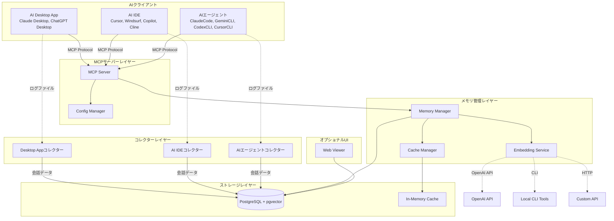

# 設計書

## 概要

Liteモードは、Context Store MCPシステムを個人用PCで効率的に実行できるようにする軽量動作モードです。本設計では、Neo4jとRedisへの依存を排除し、PostgreSQLのみで動作する構成を実現します。また、各種AI Desktop App（Claude Desktop、ChatGPT Desktopなど）、AI IDE（Cursor、Windsurf、Copilot、Clineなど）、AIエージェント（ClaudeCode、GeminiCLI、CodexCLI、CursorCLIなど）から会話データを自動収集するコレクターシステムを導入し、手動での記憶保存を不要にします。

主な設計目標：
- PostgreSQLのみで動作する軽量アーキテクチャ
- オプション依存関係の優雅な劣化
- 自動化された会話データ収集
- 柔軟な埋め込み生成プロバイダーのサポート
- 個人使用に最適化された検索アルゴリズム
- シンプルなWeb UIによる記憶の閲覧

## アーキテクチャ

### システム構成

Liteモードのアーキテクチャは、以下の主要コンポーネントで構成されます：



### 動作モード

システムは環境変数に基づいて2つのモードで動作します：

1. **Liteモード** (`LITE_MODE=true`)
   - PostgreSQLのみを使用
   - インメモリキャッシュを使用
   - グラフストレージ機能を無効化
   - メモリ使用量: 500MB未満（アイドル時）

2. **フルモード** (デフォルト)
   - PostgreSQL + Neo4j + Redis
   - 完全なグラフストレージ機能
   - Redisベースのキャッシング

### 優雅な劣化戦略

システムは、オプション依存関係が利用できない場合でも動作を継続します：

- **Neo4j不在**: グラフストレージ操作をスキップし、警告をログに記録
- **Redis不在**: インメモリキャッシュにフォールバック
- **埋め込みサービス不在**: ベクトル検索なしで記憶を保存

## コンポーネントとインターフェース

### 1. 設定マネージャー (Config Manager)

環境変数を読み取り、システムの動作モードを決定します。

```typescript
interface LiteModeConfig {
  liteMode: boolean;
  enableGraphStore: boolean;
  enableRedisCache: boolean;
  embeddingProvider: 'openai' | 'local-cli' | 'custom-api';
  embeddingCliCommand?: string;
  embeddingApiEndpoint?: string;
}

class ConfigManager {
  loadConfig(): LiteModeConfig;
  isLiteMode(): boolean;
  isGraphStoreEnabled(): boolean;
  isRedisCacheEnabled(): boolean;
  getEmbeddingProvider(): EmbeddingProviderConfig;
}
```

### 2. ストレージアダプター拡張

既存のストレージアダプターを拡張し、オプション依存関係の優雅な劣化をサポートします。

```typescript
interface OptionalStorageAdapter {
  isAvailable(): boolean;
  initialize(): Promise<void>;
  gracefulShutdown(): Promise<void>;
}

class GraphStoreAdapter implements OptionalStorageAdapter {
  private enabled: boolean;
  
  async initialize(): Promise<void> {
    if (!this.enabled) {
      logger.warn('Graph store disabled in Lite Mode');
      return;
    }
    // Neo4j接続処理
  }
  
  isAvailable(): boolean {
    return this.enabled && this.connection !== null;
  }
}
```

### 3. キャッシュマネージャー

Redisとインメモリキャッシュのフォールバックをサポートします。

```typescript
interface CacheAdapter {
  get(key: string): Promise<any>;
  set(key: string, value: any, ttl?: number): Promise<void>;
  delete(key: string): Promise<void>;
  clear(): Promise<void>;
}

class InMemoryCacheAdapter implements CacheAdapter {
  private cache: Map<string, { value: any; expiry: number }>;
  private maxSize: number = 1000;
  
  // LRU eviction policy
  async set(key: string, value: any, ttl: number = 3600): Promise<void> {
    if (this.cache.size >= this.maxSize) {
      this.evictOldest();
    }
    this.cache.set(key, {
      value,
      expiry: Date.now() + ttl * 1000
    });
  }
}

class CacheManager {
  private adapter: CacheAdapter;
  
  constructor(config: LiteModeConfig) {
    if (config.enableRedisCache) {
      this.adapter = new RedisCacheAdapter();
    } else {
      this.adapter = new InMemoryCacheAdapter();
    }
  }
}
```

### 4. 埋め込みサービス

複数の埋め込み生成プロバイダーをサポートします。

```typescript
interface EmbeddingProvider {
  generateEmbedding(text: string): Promise<number[]>;
  isAvailable(): Promise<boolean>;
}

class OpenAIEmbeddingProvider implements EmbeddingProvider {
  async generateEmbedding(text: string): Promise<number[]> {
    // OpenAI API呼び出し
  }
}

class LocalCLIEmbeddingProvider implements EmbeddingProvider {
  private command: string;
  
  async generateEmbedding(text: string): Promise<number[]> {
    // CLIコマンド実行（例: gemini-cli embed, cursor-cli embed）
    const result = await exec(`${this.command} "${text}"`);
    return JSON.parse(result.stdout);
  }
}

class CustomAPIEmbeddingProvider implements EmbeddingProvider {
  private endpoint: string;
  
  async generateEmbedding(text: string): Promise<number[]> {
    // カスタムAPIエンドポイントへのHTTPリクエスト
    const response = await fetch(this.endpoint, {
      method: 'POST',
      body: JSON.stringify({ text })
    });
    return response.json();
  }
}

class EmbeddingService {
  private provider: EmbeddingProvider;
  
  constructor(config: LiteModeConfig) {
    switch (config.embeddingProvider) {
      case 'local-cli':
        this.provider = new LocalCLIEmbeddingProvider(config.embeddingCliCommand);
        break;
      case 'custom-api':
        this.provider = new CustomAPIEmbeddingProvider(config.embeddingApiEndpoint);
        break;
      default:
        this.provider = new OpenAIEmbeddingProvider();
    }
  }
  
  async generateEmbedding(text: string): Promise<number[] | null> {
    try {
      return await this.provider.generateEmbedding(text);
    } catch (error) {
      logger.error('Embedding generation failed', error);
      return null;
    }
  }
}
```

### 5. コレクターシステム

AIツールのログファイルを監視し、会話データを自動収集します。

```typescript
interface CollectorConfig {
  logPath: string;
  source: string; // 'claude-desktop', 'chatgpt-desktop', 'cursor', 'windsurf', 'claude-code', 'gemini-cli' など
  sourceType: 'desktop-app' | 'ide' | 'cli-agent'; // AI Desktop App、AI IDE、またはCLIエージェント
  pollInterval: number;
  stateFile: string;
}

interface ConversationEntry {
  userMessage: string;
  aiResponse: string;
  timestamp: Date;
  projectContext?: string;
}

abstract class BaseCollector {
  protected config: CollectorConfig;
  protected lastPosition: number = 0;
  
  abstract parseLogEntry(line: string): ConversationEntry | null;
  
  async start(): Promise<void> {
    this.loadState();
    this.watchLogFile();
  }
  
  async stop(): Promise<void> {
    this.saveState();
  }
  
  private async watchLogFile(): Promise<void> {
    const watcher = fs.watch(this.config.logPath);
    for await (const event of watcher) {
      if (event.eventType === 'change') {
        await this.processNewContent();
      }
    }
  }
  
  private async processNewContent(): Promise<void> {
    const content = await fs.readFile(this.config.logPath, 'utf-8');
    const newContent = content.slice(this.lastPosition);
    const lines = newContent.split('\n');
    
    for (const line of lines) {
      const entry = this.parseLogEntry(line);
      if (entry) {
        await this.storeMemory(entry);
      }
    }
    
    this.lastPosition = content.length;
  }
  
  private async storeMemory(entry: ConversationEntry): Promise<void> {
    const tags = [
      `source:${this.config.source}`,
      entry.projectContext ? `project:${entry.projectContext}` : null
    ].filter(Boolean);
    
    await memoryManager.storeMemory({
      content: `User: ${entry.userMessage}\nAI: ${entry.aiResponse}`,
      type: 'episodic',
      tags,
      timestamp: entry.timestamp
    });
  }
  
  private loadState(): void {
    if (fs.existsSync(this.config.stateFile)) {
      const state = JSON.parse(fs.readFileSync(this.config.stateFile, 'utf-8'));
      this.lastPosition = state.lastPosition;
    }
  }
  
  private saveState(): void {
    fs.writeFileSync(
      this.config.stateFile,
      JSON.stringify({ lastPosition: this.lastPosition })
    );
  }
}

// AI Desktop App用コレクター（Claude Desktop、ChatGPT Desktopなど）
class DesktopAppCollector extends BaseCollector {
  parseLogEntry(line: string): ConversationEntry | null {
    // Desktop App固有のログフォーマットを解析
    // 多くのDesktop AppはJSON形式のログを使用
    try {
      const log = JSON.parse(line);
      if (log.type === 'conversation' || log.type === 'message') {
        return {
          userMessage: log.user_message || log.prompt,
          aiResponse: log.ai_response || log.completion,
          timestamp: new Date(log.timestamp),
          projectContext: log.project || log.workspace
        };
      }
    } catch (error) {
      return null;
    }
    return null;
  }
}

// AI IDE用コレクター（Cursor、Windsurf、Copilot、Clineなど）
class AIIDECollector extends BaseCollector {
  parseLogEntry(line: string): ConversationEntry | null {
    // AI IDE固有のログフォーマットを解析
    // IDEによってJSON形式またはプレーンテキスト形式
    try {
      // まずJSON形式を試す
      const log = JSON.parse(line);
      if (log.type === 'chat' || log.type === 'completion') {
        return {
          userMessage: log.input || log.query,
          aiResponse: log.output || log.response,
          timestamp: new Date(log.timestamp),
          projectContext: log.workspace || log.project
        };
      }
    } catch {
      // JSON解析失敗時はプレーンテキスト形式を試す
      const userMatch = line.match(/^User: (.+)$/);
      const aiMatch = line.match(/^AI: (.+)$/);
      
      if (userMatch && this.nextLineIsAI) {
        // 状態管理が必要
      }
    }
    
    return null;
  }
}

// CLIエージェント用コレクター（ClaudeCode、GeminiCLI、CodexCLI、CursorCLIなど）
class CLIAgentCollector extends BaseCollector {
  parseLogEntry(line: string): ConversationEntry | null {
    // CLIエージェント固有のログフォーマットを解析
    // CLIツールは通常プレーンテキストまたはJSON形式
    try {
      const log = JSON.parse(line);
      if (log.type === 'interaction' || log.type === 'command') {
        return {
          userMessage: log.input || log.command,
          aiResponse: log.output || log.result,
          timestamp: new Date(log.timestamp),
          projectContext: log.cwd || log.workspace
        };
      }
    } catch {
      // プレーンテキスト形式の解析
      const commandMatch = line.match(/^\$ (.+)$/);
      const responseMatch = line.match(/^> (.+)$/);
      
      if (commandMatch || responseMatch) {
        // 状態管理が必要
      }
    }
    
    return null;
  }
}
```

### 6. 検索クエリプロセッサー拡張

Liteモード用に最適化された検索パラメータを提供します。

```typescript
interface SearchWeights {
  recency: number;
  relevance: number;
  procedural: number;
  filePath: number;
}

class LiteModeQueryProcessor extends QueryProcessor {
  private getLiteModeWeights(): SearchWeights {
    return {
      recency: 0.4,      // 新しさを重視
      relevance: 0.3,    // 関連性
      procedural: 0.2,   // 手続き記憶を優先
      filePath: 0.1      // ファイルパスコンテキスト
    };
  }
  
  async search(query: string, context?: SearchContext): Promise<SearchResult[]> {
    const weights = this.getLiteModeWeights();
    
    // ファイルパスコンテキストがある場合、関連記憶を優先
    if (context?.filePath) {
      const filePathResults = await this.searchByFilePath(context.filePath);
      // 結果をマージして重み付け
    }
    
    // 手続き記憶タイプにブーストを適用
    const results = await super.search(query);
    return results.map(r => {
      if (r.memoryType === 'procedural') {
        r.score *= (1 + weights.procedural);
      }
      return r;
    }).sort((a, b) => b.score - a.score);
  }
}
```

### 7. Web Viewer（オプション）

PostgreSQLデータを閲覧するためのシンプルなWebインターフェース。

```typescript
interface ViewerConfig {
  port: number;
  authEnabled: boolean;
  authToken?: string;
}

class MemoryViewer {
  private app: Express;
  
  constructor(config: ViewerConfig) {
    this.app = express();
    this.setupRoutes();
    this.setupAuth(config);
  }
  
  private setupRoutes(): void {
    // GET /memories - 記憶一覧（時系列）
    this.app.get('/memories', async (req, res) => {
      const memories = await this.fetchMemories({
        limit: 50,
        offset: req.query.offset || 0,
        orderBy: 'timestamp DESC'
      });
      res.json(memories);
    });
    
    // POST /search - テキスト・ベクトル検索
    this.app.post('/search', async (req, res) => {
      const { query, searchType } = req.body;
      const results = searchType === 'vector'
        ? await this.vectorSearch(query)
        : await this.textSearch(query);
      res.json(results);
    });
  }
  
  private setupAuth(config: ViewerConfig): void {
    if (config.authEnabled) {
      this.app.use((req, res, next) => {
        const token = req.headers.authorization?.split(' ')[1];
        if (token !== config.authToken) {
          return res.status(401).json({ error: 'Unauthorized' });
        }
        next();
      });
    }
  }
}
```

## データモデル

### PostgreSQL スキーマ拡張

Liteモードでは、既存のPostgreSQLスキーマを拡張し、グラフ関係の一部をJSONBカラムで保存します。

```sql
-- 既存のconversationsテーブルに追加
ALTER TABLE conversations ADD COLUMN IF NOT EXISTS lite_mode_metadata JSONB;

-- Liteモード用のインデックス
CREATE INDEX IF NOT EXISTS idx_conversations_lite_tags 
  ON conversations USING GIN ((lite_mode_metadata->'tags'));

CREATE INDEX IF NOT EXISTS idx_conversations_lite_source 
  ON conversations ((lite_mode_metadata->>'source'));

CREATE INDEX IF NOT EXISTS idx_conversations_lite_project 
  ON conversations ((lite_mode_metadata->>'project'));

-- コレクター状態管理テーブル
CREATE TABLE IF NOT EXISTS collector_state (
  collector_id VARCHAR(255) PRIMARY KEY,
  last_position BIGINT NOT NULL,
  last_updated TIMESTAMP DEFAULT CURRENT_TIMESTAMP
);
```

### メタデータ構造

```typescript
interface LiteModeMetadata {
  source: string; // 'claude-desktop', 'chatgpt-desktop', 'cursor', 'windsurf', 'claude-code', 'gemini-cli' など
  sourceType: 'desktop-app' | 'ide' | 'cli-agent'; // AI Desktop App、AI IDE、またはCLIエージェント
  project?: string;
  tags: string[];
  filePath?: string;
  collectorVersion: string;
}
```

## 正確性プロパティ

*プロパティとは、システムのすべての有効な実行において真であるべき特性または動作です。本質的には、システムが何をすべきかについての形式的な記述です。プロパティは、人間が読める仕様と機械で検証可能な正確性保証との橋渡しとして機能します。*


### プロパティリフレクション

事前作業分析を完了した後、冗長性を排除するためにプロパティのリフレクションを実施しました：

**冗長性の特定:**
- 1.1と1.4は類似（Liteモード起動時の動作）→ 1つのプロパティに統合
- 1.2と11.1は類似（Neo4j不在時の動作）→ 11.1に統合
- 1.3と11.2は類似（Redis不在時の動作）→ 11.2に統合
- 3.1と3.2は同じロジック（ログ監視）→ 1つのプロパティに統合
- 4.1と4.2は同じロジック（ソースタグ付け）→ 1つのプロパティに統合
- 6.1、6.2、6.5はドキュメント/設定例の内容確認 → exampleとして扱う
- 8.1-8.4はDocker Compose設定の確認 → exampleとして扱う
- 9.1と9.3はUI機能の提供確認 → exampleとして扱う

**統合後のプロパティ:**
- Liteモード起動時の依存関係スキップ（1.1 + 1.4）
- 環境変数による設定制御（2.1-2.5）
- ログファイル監視と解析（3.1-3.5統合）
- 自動タグ付けと分類（4.1-4.5統合）
- コレクター状態管理（5.1-5.5）
- 検索最適化（7.1-7.5）
- 埋め込みプロバイダー選択（10.1-10.5）
- 優雅な劣化（11.1-11.5統合）

### プロパティ一覧

**プロパティ1: Liteモード起動時の依存関係スキップ**
*任意の*システム設定において、`LITE_MODE=true`が設定されている場合、システム起動時にNeo4jおよびRedisへの接続初期化がスキップされ、PostgreSQLのみが初期化されなければならない
**検証: 要件 1.1, 1.4**

**プロパティ2: 環境変数による設定制御**
*任意の*環境変数設定において、`ENABLE_GRAPH_STORE`または`ENABLE_REDIS_CACHE`が`false`に設定されている場合、対応する機能が無効化され、システムは代替実装を使用しなければならない
**検証: 要件 2.2, 2.3**

**プロパティ3: 設定デフォルト値**
*任意の*起動シナリオにおいて、Liteモード関連の環境変数が設定されていない場合、システムはフルモード（すべての依存関係を使用）をデフォルトとして動作しなければならない
**検証: 要件 2.4**

**プロパティ4: 無効な設定のハンドリング**
*任意の*無効な設定値において、システムは警告をログに記録し、安全なデフォルト値を使用して動作を継続しなければならない
**検証: 要件 2.5**

**プロパティ5: ログファイル監視**
*任意の*監視対象ログファイルにおいて、新しいコンテンツが追加された場合、コレクターはリアルタイムでそれを検出しなければならない
**検証: 要件 3.1, 3.2**

**プロパティ6: 会話データ解析**
*任意の*有効な会話ログエントリにおいて、パーサーはユーザーメッセージとAI応答を個別に抽出しなければならない
**検証: 要件 3.3**

**プロパティ7: 解析エラーの継続動作**
*任意の*無効なログエントリにおいて、パーサーがエラーに遭遇した場合、システムはエラーをログに記録し、クラッシュせずに監視を継続しなければならない
**検証: 要件 3.5**

**プロパティ8: ソースタグの自動付与**
*任意の*コレクターから保存される記憶において、そのコレクターのソース（claude-desktop、chatgpt-desktop、cursor、windsurf、claude-code、gemini-cliなど）に対応するタグが自動的に追加されなければならない
**検証: 要件 4.1, 4.2, 4.3**

**プロパティ9: プロジェクトタグの自動付与**
*任意の*プロジェクトコンテキストを含む会話データにおいて、`project:{project_name}`タグが自動的に追加されなければならない
**検証: 要件 4.3**

**プロパティ10: エピソード記憶分類**
*任意の*コレクターから保存される会話データにおいて、それはエピソード記憶タイプとして分類されなければならない
**検証: 要件 4.4**

**プロパティ11: 複数タグの保存**
*任意の*記憶において、複数のタグが該当する場合、すべての関連タグが保存されなければならない
**検証: 要件 4.5**

**プロパティ12: コレクター起動時の接続確立**
*任意の*コレクタープロセスにおいて、起動時にMCPサーバーまたはPostgreSQLデータベースへの接続が確立されなければならない
**検証: 要件 5.1**

**プロパティ13: 増分処理**
*任意の*ログファイル変更において、コレクターは前回のチェック以降の新しいコンテンツのみを処理し、既に処理済みのコンテンツを再処理してはならない
**検証: 要件 5.2**

**プロパティ14: 指数バックオフ再試行**
*任意の*接続エラーにおいて、コレクターは指数バックオフアルゴリズムを使用して再試行し、各再試行の間隔は前回の間隔の2倍でなければならない
**検証: 要件 5.3**

**プロパティ15: 状態保存**
*任意の*コレクター停止において、現在のログファイル読み取り位置が永続化され、再起動時に復元されなければならない
**検証: 要件 5.4**

**プロパティ16: 重複防止**
*任意の*会話データにおいて、複数のコレクターが同時に実行されている場合でも、同じデータが複数回保存されてはならない
**検証: 要件 5.5**

**プロパティ17: 設定ファイル生成の有効性**
*任意の*設定生成リクエストにおいて、生成される`claude_desktop_config.json`ファイルは有効なJSON形式でなければならない
**検証: 要件 6.3**

**プロパティ18: 環境適応設定生成**
*任意の*ユーザー環境において、生成される設定ファイルはその環境に適したコマンドと引数を含まなければならない
**検証: 要件 6.4**

**プロパティ19: Liteモード検索の新しさ重視**
*任意の*Liteモードでの検索クエリにおいて、新しさスコアの重みは標準モードよりも高く設定されなければならない
**検証: 要件 7.1**

**プロパティ20: 手続き記憶のスコアブースト**
*任意の*検索結果において、手続き記憶タイプの記憶は他のタイプよりも高い関連性スコアを持たなければならない
**検証: 要件 7.2**

**プロパティ21: ファイルパスコンテキストの優先**
*任意の*ファイルパスコンテキストを含む検索クエリにおいて、同じファイルパスに関連付けられた記憶は他の記憶よりも高くランク付けされなければならない
**検証: 要件 7.3**

**プロパティ22: 同スコア時の新しさ優先**
*任意の*同じ関連性スコアを持つ複数の記憶において、より最近のタイムスタンプを持つ記憶が上位にランク付けされなければならない
**検証: 要件 7.4**

**プロパティ23: Liteモードデフォルトパラメータ**
*任意の*検索パラメータが指定されていない検索において、Liteモードでは個人使用に最適化されたデフォルト値が使用されなければならない
**検証: 要件 7.5**

**プロパティ24: データボリューム永続化**
*任意の*Docker Composeサービス停止において、PostgreSQLのデータボリュームは保持され、再起動時に利用可能でなければならない
**検証: 要件 8.5**

**プロパティ25: 記憶の時系列表示**
*任意の*Web Viewerでの記憶表示において、記憶はタイムスタンプの降順（新しい順）でソートされなければならない
**検証: 要件 9.2**

**プロパティ26: 検索結果のハイライトとスコア表示**
*任意の*Web Viewerでの検索結果において、一致するコンテンツがハイライトされ、関連性スコアが表示されなければならない
**検証: 要件 9.4**

**プロパティ27: Web Viewer認証**
*任意の*認証が有効なWeb Viewerへのアクセスにおいて、有効な認証トークンなしでのアクセスは拒否されなければならない
**検証: 要件 9.5**

**プロパティ28: 埋め込みプロバイダー選択**
*任意の*`EMBEDDING_PROVIDER`環境変数設定において、システムは指定されたプロバイダー（openai、local-cli、custom-api）を使用しなければならない
**検証: 要件 10.1**

**プロパティ29: CLI埋め込み生成**
*任意の*`EMBEDDING_PROVIDER=local-cli`設定において、システムは`EMBEDDING_CLI_COMMAND`で指定されたCLIコマンドを実行してベクトル埋め込みを生成しなければならない
**検証: 要件 10.2**

**プロパティ30: カスタムAPI埋め込み生成**
*任意の*`EMBEDDING_PROVIDER=custom-api`設定において、システムは`EMBEDDING_API_ENDPOINT`で指定されたエンドポイントにリクエストを送信しなければならない
**検証: 要件 10.3**

**プロパティ31: 埋め込みプロバイダーデフォルト**
*任意の*`EMBEDDING_PROVIDER`が設定されていない場合において、システムはOpenAI APIをデフォルトプロバイダーとして使用しなければならない
**検証: 要件 10.4**

**プロパティ32: 埋め込み失敗時の記憶保存**
*任意の*埋め込み生成エラーにおいて、システムはエラーをログに記録し、ベクトル埋め込みなしで記憶を保存しなければならない
**検証: 要件 10.5**

**プロパティ33: Neo4j不在時の起動継続**
*任意の*Neo4jドライバーが利用できない環境において、システムは正常に起動し、グラフ機能の欠落について警告をログに記録しなければならない
**検証: 要件 11.1, 1.2**

**プロパティ34: Redis不在時のフォールバック**
*任意の*Redisクライアントが利用できない環境において、システムは正常に起動し、インメモリキャッシュを使用しなければならない
**検証: 要件 11.2, 1.3**

**プロパティ35: 埋め込みサービス不在時の動作継続**
*任意の*埋め込み生成サービスが利用できない環境において、システムはストレージ操作を許可し、ベクトル埋め込み生成を無効化しなければならない
**検証: 要件 11.3**

**プロパティ36: 依存関係失敗のロギング**
*任意の*オプション依存関係の読み込み失敗において、システムはどの機能が利用できないかを明確にログに記録しなければならない
**検証: 要件 11.4**

**プロパティ37: 必須依存関係での完全動作**
*任意の*すべての必須依存関係が存在する環境において、システムはオプション依存関係の有無に関係なく完全な機能で動作しなければならない
**検証: 要件 11.5**

## エラーハンドリング

### エラー分類

Liteモードでは、以下のエラーカテゴリを定義します：

1. **致命的エラー** - システム起動を妨げる
   - PostgreSQL接続失敗
   - 必須環境変数の欠落
   - 設定ファイルの破損

2. **回復可能エラー** - 機能の一部が利用不可
   - Neo4j接続失敗（グラフ機能無効化）
   - Redis接続失敗（インメモリキャッシュにフォールバック）
   - 埋め込みサービス失敗（ベクトル検索無効化）

3. **一時的エラー** - 再試行可能
   - ネットワークタイムアウト
   - 一時的なデータベース接続エラー
   - API レートリミット

### エラーハンドリング戦略

```typescript
class ErrorHandler {
  handleError(error: Error, context: ErrorContext): ErrorResponse {
    if (this.isFatalError(error)) {
      logger.error('Fatal error, shutting down', { error, context });
      process.exit(1);
    }
    
    if (this.isRecoverableError(error)) {
      logger.warn('Recoverable error, degrading functionality', { error, context });
      this.degradeGracefully(error, context);
      return { success: false, degraded: true };
    }
    
    if (this.isRetryableError(error)) {
      logger.info('Retryable error, scheduling retry', { error, context });
      return this.scheduleRetry(error, context);
    }
    
    logger.error('Unexpected error', { error, context });
    return { success: false, error: error.message };
  }
  
  private degradeGracefully(error: Error, context: ErrorContext): void {
    if (error instanceof Neo4jConnectionError) {
      this.disableGraphStore();
    } else if (error instanceof RedisConnectionError) {
      this.switchToInMemoryCache();
    } else if (error instanceof EmbeddingServiceError) {
      this.disableVectorEmbedding();
    }
  }
}
```

### ログレベル

- **ERROR**: 致命的エラー、予期しないエラー
- **WARN**: 回復可能エラー、機能劣化
- **INFO**: 正常な動作、重要なイベント
- **DEBUG**: 詳細なデバッグ情報（開発時のみ）

## テスト戦略

### ユニットテスト

各コンポーネントの個別機能をテストします：

- **ConfigManager**: 環境変数の読み取りと解析
- **CacheManager**: インメモリキャッシュのLRU eviction
- **EmbeddingService**: 各プロバイダーの埋め込み生成
- **BaseCollector**: ログファイル解析と状態管理
- **ErrorHandler**: エラー分類と優雅な劣化

### プロパティベーステスト

プロパティベーステストには**fast-check**ライブラリを使用します。各テストは最低100回の反復を実行します。

#### テスト例

```typescript
import fc from 'fast-check';

describe('Property-Based Tests', () => {
  // Feature: lite-mode, Property 1: Liteモード起動時の依存関係スキップ
  it('should skip Neo4j and Redis initialization in Lite Mode', () => {
    fc.assert(
      fc.property(
        fc.record({
          LITE_MODE: fc.constant('true'),
          POSTGRES_HOST: fc.string(),
          POSTGRES_PORT: fc.integer({ min: 1024, max: 65535 })
        }),
        async (env) => {
          const config = new ConfigManager(env);
          const system = new System(config);
          await system.initialize();
          
          expect(system.graphStore.isInitialized()).toBe(false);
          expect(system.redisCache.isInitialized()).toBe(false);
          expect(system.postgresStore.isInitialized()).toBe(true);
        }
      ),
      { numRuns: 100 }
    );
  });
  
  // Feature: lite-mode, Property 13: 増分処理
  it('should process only new content since last check', () => {
    fc.assert(
      fc.property(
        fc.array(fc.string(), { minLength: 1, maxLength: 100 }),
        fc.integer({ min: 0, max: 50 }),
        async (logLines, lastPosition) => {
          const collector = new TestCollector();
          collector.lastPosition = lastPosition;
          
          const processedLines = await collector.processNewContent(logLines);
          
          expect(processedLines.length).toBe(
            Math.max(0, logLines.length - lastPosition)
          );
        }
      ),
      { numRuns: 100 }
    );
  });
  
  // Feature: lite-mode, Property 14: 指数バックオフ再試行
  it('should use exponential backoff for retries', () => {
    fc.assert(
      fc.property(
        fc.integer({ min: 1, max: 10 }),
        (retryCount) => {
          const backoff = calculateBackoff(retryCount);
          const expectedMin = Math.pow(2, retryCount - 1) * 1000;
          const expectedMax = Math.pow(2, retryCount) * 1000;
          
          expect(backoff).toBeGreaterThanOrEqual(expectedMin);
          expect(backoff).toBeLessThanOrEqual(expectedMax);
        }
      ),
      { numRuns: 100 }
    );
  });
  
  // Feature: lite-mode, Property 22: 同スコア時の新しさ優先
  it('should rank more recent memories higher when scores are equal', () => {
    fc.assert(
      fc.property(
        fc.array(
          fc.record({
            content: fc.string(),
            score: fc.constant(0.8),
            timestamp: fc.date()
          }),
          { minLength: 2, maxLength: 10 }
        ),
        (memories) => {
          const sorted = sortSearchResults(memories);
          
          for (let i = 0; i < sorted.length - 1; i++) {
            if (sorted[i].score === sorted[i + 1].score) {
              expect(sorted[i].timestamp.getTime()).toBeGreaterThanOrEqual(
                sorted[i + 1].timestamp.getTime()
              );
            }
          }
        }
      ),
      { numRuns: 100 }
    );
  });
});
```

### 統合テスト

システム全体の動作をテストします：

- Liteモードでの起動と動作
- コレクターからMCPサーバーへのデータフロー
- 埋め込みプロバイダーの切り替え
- 優雅な劣化のシナリオ

### E2Eテスト

実際の使用シナリオをテストします：

- 各種AI Desktop App（Claude Desktop、ChatGPT Desktopなど）からの会話収集
- 各種AI IDE（Cursor、Windsurf、Copilot、Clineなど）からの会話収集
- 各種CLIエージェント（ClaudeCode、GeminiCLI、CodexCLI、CursorCLIなど）からの会話収集
- Web Viewerでの記憶閲覧
- 検索機能の動作確認

## 実装の考慮事項

### パフォーマンス

- **インメモリキャッシュのサイズ制限**: 最大1000エントリ、LRU eviction
- **コレクターのポーリング間隔**: デフォルト1秒、設定可能
- **バッチ処理**: 複数のログエントリを一度に処理
- **接続プーリング**: PostgreSQL接続の再利用

### セキュリティ

- **Web Viewer認証**: トークンベース認証
- **ログファイルアクセス**: 読み取り専用アクセス
- **環境変数の保護**: 機密情報の暗号化
- **SQLインジェクション対策**: パラメータ化クエリ

### 運用

- **ログローテーション**: 日次ローテーション、7日間保持
- **メトリクス収集**: Prometheus形式でエクスポート
- **ヘルスチェック**: `/health`エンドポイント
- **グレースフルシャットダウン**: SIGTERM/SIGINTハンドリング

### 互換性

- **既存データとの互換性**: 既存のPostgreSQLスキーマを拡張
- **フルモードへの切り替え**: 環境変数変更のみで可能
- **バージョン管理**: セマンティックバージョニング
- **マイグレーション**: データベーススキーマのマイグレーションスクリプト
